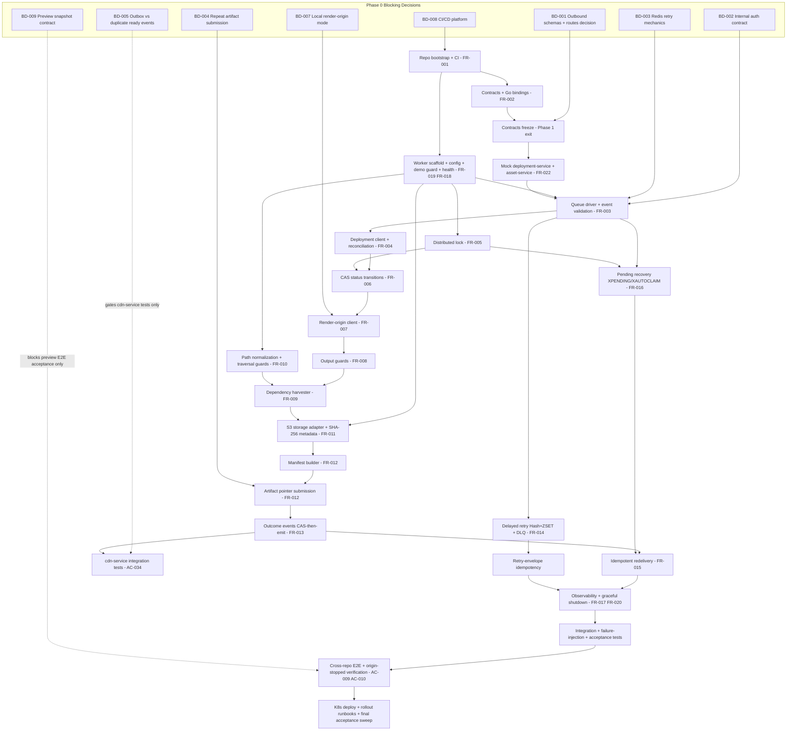

# Implementation Plan: `anvilkit-export-worker`

| | |
| --- | --- |
| **Document ID** | PLAN-0001 |
| **Type** | Engineering milestone plan, implementation roadmap, and task breakdown |
| **Source document** | `docs/prd/0010-render-worker-platform-backend-requirements-0701-1341.md` (Draft v3.1, conditionally approved development baseline) |
| **Supporting sources** | `docs/prd/0008-render-worker-service-0630-1156.md` (behavioral authority), `docs/prd/0009-render-worker-platform-monorepo-split-0701-1306.md` (repo boundary, Go-first direction) |
| **Target repository** | `anvilkit-platform` (separate Go-first backend monorepo) |
| **Implementation scope** | `anvilkit-export-worker` only |
| **Primary language** | Go |
| **Generated** | 2026-07-01 17:07 |
| **Status** | Ready for execution tracking |

> **Canonical naming note.** The source document (0010) names the service `anvilkit-render-worker` at `services/render-worker`. Per the platform worker naming convention, this plan uses the canonical name **`anvilkit-export-worker`** on every surface: repository `anvilkit-export-worker`, path `services/export-worker`, container image / Kubernetes Deployment / queue consumer group `export-worker`, metrics namespace `anvilkit_export_worker`, and `WORKER_NAME` default `anvilkit-export-worker`. Metric names from the source document are re-namespaced accordingly (for example `render_worker_jobs_total` becomes `anvilkit_export_worker_jobs_total`). The pre-existing service repository `anvilkit-static-publisher` (`services/static-publisher`) is the same service pending rename. **This rename is naming-only: every behavioral requirement, gate, priority, and acceptance criterion of the source document is preserved unchanged.** The rename is recorded as ADR-015 (Section 13).

---

## 1. Executive Summary

This plan converts the backend requirements document 0010 (v3.1) into an execution-ready roadmap for building `anvilkit-export-worker`, the first production service of the `anvilkit-platform` Go-first backend monorepo.

- **Purpose.** Give backend engineers, DevOps, QA, and frontend integration owners a single tracking source: milestones with entry/exit gates, 15 workstreams with task-level definitions of done, a dependency graph, an acceptance-criteria execution matrix, a test strategy, a CI/CD and release plan, a risk register, and an ADR backlog. Engineers should be able to execute day-to-day from this plan without re-reading the full requirements document.
- **Target repository.** `anvilkit-platform`, deliberately separate from `anvilkit-studio`. It is not a subdirectory or git submodule of `anvilkit-studio`. `anvilkit-render-origin` and `@anvilkit/render-runtime` remain in `anvilkit-studio`; integration is contract-only (versioned JSON Schema events, OpenAPI internal APIs, storage layout, runtime HTTP contract).
- **Implementation scope.** `anvilkit-export-worker` only: a stateless, queue-driven Go worker that consumes `deployment.export.requested`, loads the authoritative deployment record, acquires a per-`deploymentId` lock, CAS-transitions status, fetches version-pinned HTML from render-origin over HTTP, harvests dependencies deterministically, uploads hashed artifacts plus `artifact-manifest.json` to S3-compatible storage, submits the manifest pointer, and emits `deployment.artifact.ready` / `deployment.export.failed`. No other backend service is implemented; external services exist as contracts and mocks only. CDN upload, purge, verification, activation, rollback activation, and domain mapping belong to `cdn-service` and are out of scope.
- **Primary technical direction.** Go-first; Redis Streams queue at MVP behind a Kafka-ready driver seam; Redis Hash + ZSET delayed-retry model; `deploymentId` as the canonical idempotency key; SHA-256 object metadata for storage idempotency (never S3 ETag); observability (structured logs, Prometheus metrics, OpenTelemetry traces) from day one.
- **Expected outcome.** A production-deployed worker meeting the source document's success criteria: >= 99% of single-page publish jobs reach `ARTIFACT_READY` without manual intervention; P95 total worker time <= 20 s (render <= 5 s, upload <= 10 s); zero duplicate active artifacts under at-least-once redelivery; every failure classified and stage-traceable; artifacts verified self-contained with render-origin stopped.

Delivery is organized as five milestones (M1-M5) mapped one-to-one to the source document's five delivery phases, gated by the Phase 0 blocking decisions BD-001 through BD-009. All gates from the source document are preserved verbatim in Section 4.

---

## 2. Planning Principles

1. **Contracts-first delivery.** Versioned, language-neutral contracts (JSON Schema events, OpenAPI internal APIs) are authored and frozen before dependent implementation exits its phase. Breaking changes require a schema version bump plus contract-test updates (FR-002).
2. **Go-first backend implementation.** All production worker code is Go. Node/TS is allowed only for tooling, mocks, and contract generation, never production services. No Rust (AC-018).
3. **Stateless worker design.** The worker owns no database and requires no migrations. All state lives in the queue, Redis locks/retry structures, artifact storage, and the external `deployment-service` (Section 9 of the source document).
4. **Idempotency under at-least-once delivery.** `deploymentId` is the canonical idempotency key: one `deploymentId` -> at most one artifact manifest. Redelivery after `ARTIFACT_READY` acks without re-rendering; per-object skip uses `x-amz-meta-content-sha256`; retry envelopes are idempotent by `retryEnvelopeId` (FR-015, AC-008, AC-027).
5. **deployment-service as source of truth.** The deployment record, not the event, drives the job. Event hints are reconciled against the record; mismatch is non-retryable `VALIDATION_FAILED` (FR-004). All status writes are CAS; the worker owns only `EXPORT_QUEUED -> EXPORTING -> ARTIFACT_READY | EXPORT_FAILED`.
6. **Render-origin integration over HTTP only.** Version-pinned fetch with service token and `X-AnvilKit-*` pinning headers. The worker never imports React, Next.js, Puck, `@anvilkit/render-runtime`, or any `@anvilkit/*` frontend package (AC-002).
7. **No cross-repo source imports.** In either direction, ever. The Go/JS language boundary plus repository separation enforce this structurally (AC-010, AC-019).
8. **Mock-first integration until real external services exist.** `deployment-service` and `asset-service` are mocked contract-conformant (FR-022, execution priority P0-Blocker); BD-004 semantics are encoded in the mock; real-service revalidation happens before production cutover.
9. **Observability from day one.** Structured logs with required fields, Prometheus metrics, and OpenTelemetry spans are MVP requirements (FR-020), not hardening. Trace context is forwarded to render-origin so one publish is traceable across the repo boundary.
10. **Production readiness through failure-injection and acceptance tests.** The P0 reliability gates (no-ack-on-lock-conflict, pending reclaim, write-then-ack handoff, graceful drain, zero duplicate artifacts under redelivery storms) are proven by dedicated failure-injection suites before launch (AC-007, AC-014, AC-021, AC-027).
11. **Preserve every source gate and priority.** No P0 requirement is weakened; execution priorities (P0-Blocker, P0-Launch, P1-Hardening, P2-Future) sequence work without changing P0/P1/P2 meaning; all Phase 0 gates are tracked in Section 4.

---

## 3. Source Requirement Mapping

| Source section (doc 0010) | Content | How this plan uses it | Plan sections |
| --- | --- | --- | --- |
| Section 4 - Phase 0 Blocking Decisions (BD-001..BD-009) | Decisions that gate phases | Converted into a decision-gate tracking table with owners, artifacts, and preserved gates | 4, 7, 13, 14 |
| Section 7 - Functional Requirements FR-001..FR-024 | Implementation-level requirements with execution priorities | Mapped to milestones, workstreams, and task IDs; execution-priority matrix drives sequencing | 5, 6, 14, 15 |
| Section 8 - API Design | Exposed health/metrics endpoints; consumed deployment-service, render-origin, asset-service APIs | Drives contract authoring (EW-CONTRACT), client workstreams (EW-DEPLOY, EW-RENDER), and mock conformance | 6 (WS2, WS4, WS6), 11 |
| Section 10.3 / 10.3.1 / 10.3.2 / 10.3.3 - Queue, Retry, and DLQ Mechanics | Five-mechanism model, `maxRetries = 3` semantics, Hash + ZSET retry model, retry-envelope idempotency, minimum outbound schemas, retention floors | Drives the queue workstream (WS3), test strategy behaviors, and AC-021/026/027/033 execution | 6 (WS3), 8, 9 |
| Section 11 / 11.1 - Security and Internal Service Authentication Contract | Token auth, secret handling, path safety, demo guard, per-service 401/403 classification | Drives WS10 (Configuration and Security), alerting, and permission tests | 6 (WS10), 9, 10 |
| Section 12 - Transactions and Consistency | CAS + idempotency + at-least-once model; CAS-then-emit ordering; no outbox in MVP | Drives emitter ordering (WS9), BD-005 gate handling, idempotency test design | 6 (WS9), 8, 9 |
| Section 13 - Error Code Design | Full retryable/non-retryable code table incl. per-service auth codes | Drives retry classification tasks, failed-event payloads, and alert rules | 6 (WS3, WS9, WS11), 9 |
| Section 14 - Configuration Items | Env vars, defaults, secret levels, demo guard config | Drives WS10 config loader tasks and local compose environment | 6 (WS10), 11 |
| Section 15 - Logging, Monitoring, and Audit | Required log fields, metric set, span vocabulary, alert rules, audit trail | Drives WS11 observability tasks and AC-015 verification | 6 (WS11), 9, 10 |
| Section 16 - Non-Functional Requirements | Latency targets, concurrency, reliability, availability, cost control | Drives load-test targets (AC-016), lock TTL, broad-rollout guardrails | 5 (M4, M5), 9, 12 |
| Section 17 - Test Plan | Test layers and named T-* tests | Expanded into the per-milestone test strategy and WS12 tasks | 9, 6 (WS12) |
| Section 18 / 18.1 - Deployment Plan and Manual Artifact Cleanup Runbook | Topology, rollout/rollback, resources, compose, runbook minimum contents | Drives WS13 (local dev), WS14 (containerization/K8s), CI/CD plan, and AC-032 | 6 (WS13, WS14), 10, 11 |
| Section 19 - Acceptance Criteria AC-001..AC-034 | Verifiable acceptance gates | Converted into the acceptance execution matrix with milestone ownership | 8, 15 |
| Section 20 - Risks and Open Questions (OQ-1..OQ-6) | Risk table and non-blocking questions | Converted into an execution-focused risk register and the ADR backlog | 12, 13 |
| Section 21 - Milestone Plan (Phases 1-5, gates, dependency graphs) | Five delivery phases with conditional-baseline gates | Basis of the delivery roadmap (M1-M5), dependency graph, and implementation order | 5, 7, 14 |

---

## 4. Phase 0 Decision Gate Plan

Each blocking decision must be resolved - or explicitly accepted as an ADR-backed default where the source document permits - before the phase listed in "Required before" begins. Track status in this table at every milestone review; AC-020 requires all BDs documented and either resolved or explicitly `To Be Confirmed` with a recommended owner.

| ID | Decision | Required before | Recommended owner | Current status | Default recommended approach (from doc 0010) | Impact if unresolved | Required output artifact |
| --- | --- | --- | --- | --- | --- | --- | --- |
| BD-001 | Final outbound event schemas for `deployment.artifact.ready` / `deployment.export.failed`, including the `routes[]` decision | Phase 1 exit (contracts frozen) | Backend + `cdn-service` owner | Default adopted (ADR-001 Proposed) — freeze due at Phase 1 exit | Omit `routes[]` from the event; `cdn-service` reads route data from `artifact-manifest.json`; minimum schemas per source Section 10.3.2; additive-only evolution | Contracts package, worker emitter, and `cdn-service` consumption all rework; cross-repo churn after integration starts | ADR-001 + frozen schema files in `contracts/` + contract-test update (AC-029) |
| BD-002 | Internal service-to-service authentication contract (token shape, claims/scopes, rotation) | Phase 2 start | Backend + Security | Accepted as ADR-backed default (ADR-002) | Bearer `INTERNAL_SERVICE_TOKEN` (confirmed floor); claims/scopes/rotation contract per source Section 11.1; dual-token acceptance during rotation | Clients for deployment-service, asset-service, render-origin bake in the wrong scheme; rotation outage risk | ADR-002 + integration note shared with `anvilkit-studio` (render-origin) owners |
| BD-003 | Redis Streams retry, delayed retry, pending recovery, and DLQ mechanics | Phase 2 start | Backend | Accepted as ADR-backed default (ADR-003) | Five-mechanism model of source Section 10.3.1; Redis Hash retry payloads + ZSET delay index; `attempt` 0..3; write-then-ack handoff; retry-envelope idempotency | Queue driver (FR-003), retry policy (FR-014), and pending recovery (FR-016) unimplementable; double-processing or lost messages | ADR-003 + queue-driver design note + AC-021/026/027/033 test coverage |
| BD-004 | Repeated artifact submission behavior in `deployment-service` (idempotent accept vs benign conflict for identical pointer re-POST) | Phase 3 exit | `deployment-service` owner (mock owner interim) | To Be Confirmed (ADR-004 drafted; interim mock assumption: idempotent accept) | Not defaulted in source; mock must encode the agreed behavior | Idempotent redelivery (FR-015) lacks deterministic semantics; mock and real service diverge at cutover | ADR-004 + mock update + contract note in OpenAPI document |
| BD-005 | `deployment_events` as outbox vs duplicate `deployment.artifact.ready` events acceptable for MVP | Before `cdn-service` integration tests start | Backend architecture | Default accepted for worker build (ADR-005); full resolution gates cdn-service tests | CAS-then-emit with duplicate-tolerant consumers keyed by `deploymentId`; worker-side emitter (FR-013) may proceed on this default | Emitter ordering and every consumer's idempotency obligation undefined; `cdn-service` integration tests blocked (AC-034); outbox branch conflicts with PRD 0008 FR-012 unless amended | ADR-005 + `cdn-service` integration note (AC-034) |
| BD-006 | Secret management and token rotation strategy (`INTERNAL_SERVICE_TOKEN`, S3 credentials) | Phase 2 (first deployed environment) | DevOps + Security | Proposed (ADR-006) — confirm before first deployed environment | Kubernetes Secrets / secret manager injection; never in images, logs, or manifests; rotation without downtime | First deployed environment blocked; deployment manifests and config loading undefined | ADR-006 + CI/CD secret-injection decision + K8s Secret manifests |
| BD-007 | Local development integration contract with `anvilkit-studio` render-origin (source run vs published image; page-data seeding) | Phase 3 (render fetch) | Backend + Frontend Architecture | Proposed (ADR-007) — confirm with studio owners before Phase 3 | Compose service for render-origin (pattern per PRD 0008 Section 24.3) | Local compose and every Phase 3+ E2E loop lack a reproducible render-origin; flaky development | ADR-007 + compose definition + seeding fixtures + integration note with studio owners |
| BD-008 | CI/CD platform and deployment target for `anvilkit-platform` | Phase 1 start | DevOps | Resolved (ADR-008 Accepted): GitHub Actions + GHCR + Kubernetes | None given in source - this is the first decision to make; no default exists | Repo bootstrap (FR-001) has no CI from day one; image publishing and the K8s target gate Phases 4-5 | ADR-008 + CI pipeline definition + CD/deployment-target decision |
| BD-009 | Immutable preview snapshot contract and availability (`publish-service` / `deployment-service` capability) | Phase 3 preview E2E acceptance (deferred with FR-024) | Backend + Frontend Architecture + `deployment-service` owner | Blocked (external) — tracked (ADR-009) | Worker always sends pinning headers so preview flows through the same version-pinned path; acceptance deferred until upstream snapshots exist | Preview E2E acceptance cannot pass outside local development; preview risks rendering mutable drafts | ADR-009 + snapshot contract update + AC-030 tracking entry |

### Preserved gates (verbatim from the source conditional baseline - these are hard gates)

1. **Phase 1 (repository + CI work) may start only after BD-008 is resolved.**
2. **Contract implementation must not exit Phase 1 until BD-001 is resolved** (including the `routes[]` decision; default recommended decision in source Section 10.3.2).
3. **Phase 2 worker runtime work must not start until BD-002 and BD-003 are resolved or accepted as ADR-backed defaults.**
4. **`cdn-service` integration tests must not start until BD-005 is resolved** (AC-034).
5. **Preview E2E acceptance remains blocked by BD-009** (FR-024, AC-030).
6. **Broad rollout requires the FR-023 guardrail revisit (OQ-4) and the manual artifact cleanup runbook (source Section 18.1, AC-032).**

Additional intra-phase gates preserved: BD-004 before FR-012 (artifact submission) exits Phase 3; BD-006 before the first deployed environment; BD-007 before Phase 3 render-fetch E2E loops; distributed locking (FR-005) in place before any multi-worker, redelivery, or concurrency integration tests run (AC-028).

---

## 5. Delivery Roadmap

Five milestones map one-to-one to the source document's delivery phases. Task IDs reference Section 6 workstreams.

### Milestone 1 - Architecture and Platform Foundation *(source Phase 1; PRD 0009 Phases 0-1)*

- **Goals:** stand up the separate Go-first monorepo and the frozen contract layer; green CI on an empty-but-building worker scaffold.
- **Scope:** repository bootstrap, CI skeleton, boundary rules, contract schemas (inbound event, both outbound events, OpenAPI for deployment-service and asset-service), generated Go bindings, contract test suite, BD-001 resolution and schema freeze.
- **FR mappings:** FR-001 (repo bootstrap), FR-002 (versioned contracts). FR-022 (mocks) is unblocked at M1 exit and begins in M2.
- **BD dependencies:** BD-008 resolved before the milestone starts (hard gate). BD-001 resolved before the milestone exits (contracts freeze gate).
- **Concrete tasks:** EW-REPO-001..005, EW-CONTRACT-001..006 (Section 6).
- **Deliverables:** buildable `anvilkit-export-worker` scaffold at `services/export-worker` with green CI (lint, vet, unit, build); `contracts/` area with versioned JSON Schemas for `deployment.export.requested`, `deployment.artifact.ready`, `deployment.export.failed` and OpenAPI documents; generated Go types/clients; contract test suite wired into CI; dependency-audit CI gate; boundary-rules README; ADR-001, ADR-008, ADR-015 recorded.
- **Test requirements:** contract tests pass against schemas; CI dependency audit proves no React/Next.js/Puck/`@anvilkit/*` frontend packages and Node/TS only under tooling; schema round-trip tests for generated bindings.
- **Exit criteria:** green CI on the empty worker; contract tests pass; outbound event schemas frozen (BD-001 resolved, `routes[]` decision recorded); AC-001 and AC-020 verifiable.
- **Acceptance criteria mapping:** AC-001, AC-020, AC-029 (blocking at exit); AC-023 (schema side), AC-002 and AC-018 (initial audit gates), AC-024, AC-025 (plan/document consistency reviews).

### Milestone 2 - Worker Skeleton, Queue, and Deployment Flow *(source Phase 2; PRD 0009 Phases 2-3)*

- **Goals:** a running Go worker that consumes, validates, locks, and transitions status - no rendering yet.
- **Scope (all items required):**
  - Config loading with startup fail-fast validation (FR-019).
  - Demo guard: `RENDER_ORIGIN_URL` pointing at `apps/demo` rejected outside local development; guard mechanism per ADR-010 (OQ-1).
  - Redis Streams queue driver behind the Kafka-ready driver interface, consumer group `export-worker` (FR-003, FR-021 seam).
  - Event schema validation against the versioned contract; unparseable events (no extractable `deploymentId`) routed to DLQ with alert, original acked only after successful DLQ handoff, no status update.
  - DLQ path: `anvilkit:deployment.export.dlq` stream with full DLQEntry metadata (original payload, final errorCode, failedStage, attempt, traceId, workerId, timestamps).
  - Delayed retry using Redis Hash (`anvilkit:deployment.export.retry:payloads`) and ZSET (`anvilkit:deployment.export.retry:zset` scored by `nextAttemptAt`), with the dispatcher loop (ZRANGEBYSCORE, re-enqueue, remove member and payload only after successful re-enqueue).
  - Retry-envelope idempotency: `retryEnvelopeId = deploymentId + ":" + attempt + ":" + lastErrorCode` (or ADR-approved alternative `eventId + ":" + attempt`); repeated HSET is a harmless overwrite, never a second envelope.
  - Mock deployment-service and asset-service, contract-conformant (FR-022; Go recommended to exercise generated bindings; BD-004 semantics encoded once decided).
  - Distributed lock: `lock:deployment:{deploymentId}` via SET NX PX, TTL = renderTimeout + uploadTimeout + 60 s (min 90 s), heartbeat renewal, owner-checked release (FR-005).
  - Deployment record load and event-hint reconciliation; mismatch -> non-retryable `VALIDATION_FAILED` (FR-004).
  - CAS status transitions with 409 `STATUS_CONFLICT` stop-safe handling; worker sets only `EXPORTING` / `ARTIFACT_READY` / `EXPORT_FAILED` (FR-006).
  - Retry classification per the Section 13 error-code table; `maxRetries = 3` semantics (attempt 0..3, four executions max) (FR-014).
  - Health/readiness endpoints, structured logging, and metrics plumbing started (FR-018, FR-020 partial); container image and local compose skeleton.
- **FR mappings:** FR-003, FR-004, FR-005, FR-006, FR-014, FR-016 (initial mechanics), FR-018, FR-019, FR-020 (partial), FR-021 (seam), FR-022.
- **BD dependencies:** BD-002 and BD-003 resolved or accepted as ADR-backed defaults **before this milestone starts** (hard gate); BD-006 before the first deployed environment.
- **Concrete tasks:** EW-QUEUE-001..009, EW-DEPLOY-001..003 and 005, EW-LOCK-001..004, EW-CONFIG-001..005, EW-OBS-001 (initial), EW-OBS-004, EW-LOCAL-001..004, EW-K8S-001, EW-TEST-001..003.
- **Deliverables:** running worker container consuming from Redis Streams against mocks in compose; DLQ and delayed-retry paths implemented and tested; lock module; deployment client with CAS; classification table implemented; ADR-002, ADR-003, ADR-006, ADR-010 recorded.
- **Test requirements:** unparseable-event DLQ handoff-then-ack proven; lock-conflict no-ack proven; pending-recovery vs business-retry distinction proven in a harness test; delayed-retry dispatch and retry-envelope idempotency proven; `maxRetries = 3` four-execution semantics proven; demo-guard startup test.
- **Exit criteria:** AC-011 and AC-012 pass; AC-021 (initial harness proof), AC-026, AC-027, AC-033 pass; lock in place before any redelivery/multi-worker tests (AC-028).
- **Acceptance criteria mapping:** AC-011, AC-012, AC-021 (initial), AC-026, AC-027, AC-028, AC-033.

### Milestone 3 - Render Fetch, Artifact Pipeline, and Storage *(source Phase 3; PRD 0009 Phases 4-6)*

- **Goals:** produce complete, self-contained, idempotent artifacts end-to-end against mocks plus a real render-origin.
- **Scope (all items required):**
  - Render-origin HTTP client with `Authorization: Bearer <INTERNAL_SERVICE_TOKEN>` and version-pinning headers (`X-AnvilKit-Render-Worker`, `X-AnvilKit-Deployment-Id`, `X-AnvilKit-Page-Id`, `X-AnvilKit-Version`, `X-AnvilKit-Team-Id`, `X-AnvilKit-Site-Id`, `X-AnvilKit-Environment`); trace context forwarded (FR-007).
  - Response classification: 2xx+text/html success; 401/403/404/409 non-retryable (`RENDER_ORIGIN_401/403/404`, `VERSION_SLUG_MISMATCH`); 5xx/timeout retryable.
  - Render output guards: non-HTML rejection; `/_next/image` -> `UNSUPPORTED_DYNAMIC_IMAGE_OPTIMIZER`; residual `asset://` in HTML or downloaded same-origin CSS -> `UNRESOLVED_ASSET_REF` (FR-008).
  - Deterministic dependency harvesting: HTML tags (`link href`, `script src`, `img src`, `source src`, `srcset`, `og:image`/`twitter:image`), same-origin CSS `url(...)`; `DEPENDENCY_ALLOWLIST` enforcement; external URLs only via `EXTERNAL_ASSET_ALLOWLIST`, size-limited; mirror under original paths, no HTML rewriting (FR-009).
  - Path normalization and traversal guards: URL-decode then normalize; reject `../`, empty segments, control characters, drive prefixes, encoded traversal -> `PATH_TRAVERSAL_DETECTED`; slug mapping rules; keys confined to `sites/{siteId}/deployments/{deploymentId}/` (FR-010).
  - S3-compatible storage adapter (MinIO local; S3/R2/OSS/COS prod) with concurrent uploads (8-16 per deployment) (FR-011).
  - Multipart upload for files > 16 MB preserving the metadata contract.
  - SHA-256 metadata idempotency: `x-amz-meta-content-sha256` on every object; per-file `headObject` skip on matching key + hash; S3 ETag never used as a content hash.
  - Artifact manifest generation: `schemaVersion: 1`, `artifactBasePath`, `entry`, `files[]` (path/storageKey/contentHash/sizeBytes/mimeType/cacheControl), `routes[]` always an array; cache-control per file class; manifest internal-only (`private, max-age=0, no-store`), never public (FR-012).
  - Artifact pointer submission via `POST /internal/deployments/{deploymentId}/artifact` (BD-004 semantics) (FR-012).
  - Outcome events: emit `deployment.artifact.ready` after CAS to `ARTIFACT_READY`; emit `deployment.export.failed` with classified code; CAS-then-emit ordering on the BD-005 recommended default (FR-013).
- **FR mappings:** FR-007, FR-008, FR-009, FR-010, FR-011, FR-012, FR-013.
- **BD dependencies:** BD-007 (render-origin availability for local/E2E loops); BD-004 before FR-012 exits the milestone; FR-013 may proceed on BD-005's recommended CAS-then-emit default, but BD-005 must be fully resolved before any `cdn-service` integration tests start (AC-034).
- **Concrete tasks:** EW-RENDER-001..004, EW-ARTIFACT-001..006, EW-STORAGE-001..006, EW-DEPLOY-004, EW-EVENT-001..003, EW-XREPO-001, EW-TEST-004 (initial), EW-LOCAL-005.
- **Deliverables:** full happy path green in compose (consume -> render -> harvest -> upload -> manifest -> pointer -> `ARTIFACT_READY` -> ready event); ADR-004, ADR-007 recorded; manifest schema validated; emitted payloads validate against frozen outbound schemas.
- **Test requirements:** T-render-worker-happy-path; T-asset-unresolved-ref; T-next-image-guard; path-traversal corpus unit tests; multipart + metadata integration tests; manifest cache-control per-class verification; outbound payload contract tests.
- **Exit criteria:** AC-003, AC-005, AC-006, AC-023 pass; manifest schema validated; cache-control rules verified per file class; BD-004 resolved.
- **Acceptance criteria mapping:** AC-003, AC-005, AC-006, AC-017 (manifest never public + no CDN code paths, code-review side), AC-023 (emitted-payload side).

### Milestone 4 - Reliability, Security, and Observability Hardening *(source Phase 4; PRD 0009 Phase 7)*

- **Goals:** meet the P0 reliability gates and production-grade operability.
- **Scope (all items required):**
  - Pending-message reclaim via `XPENDING`/`XAUTOCLAIM`; reclaim never increments the business `attempt` counter (FR-016).
  - Idempotent redelivery: `ARTIFACT_READY` + manifest exists -> success and ack without re-render; hash-compare skip per object; zero duplicate active artifacts (FR-015).
  - Graceful shutdown on SIGTERM: stop consuming, drain or return in-flight jobs, ack/nack appropriately, release owned locks, exit cleanly (FR-017).
  - Structured logging complete: every job-scoped entry carries `traceId`, `eventId`, `deploymentId`, `teamId`, `siteId`, `pageId`, `slug`, `version`, `environment`, `renderMode`, `workerId`, `status`, `durationMs`, `errorCode` plus `attempt`, `stage`, `requestId`; no tokens/credentials ever (FR-020).
  - Prometheus metrics: full baseline set in the `anvilkit_export_worker_*` namespace (jobs/success/failed totals, job/render/harvest/upload durations, artifact bytes/files, retry total, DLQ total, lock conflicts, queue pending, retry-dispatch lag, Go runtime).
  - OpenTelemetry tracing: per-job spans `consume_job -> load_deployment -> acquire_lock -> update_status_exporting -> render_html -> harvest_dependencies -> upload_artifacts -> write_manifest -> submit_artifact -> update_status_ready -> emit_ready -> ack_message`; context forwarded to render-origin.
  - Auth failure classification: `RENDER_ORIGIN_401/403`, `DEPLOYMENT_SERVICE_401/403`, `ASSET_SERVICE_401/403` all non-retryable with ops alerts; token never in logs.
  - Alert rules per source Section 15.4 (DLQ growth, failure rate, latency SLO, auth failures, unparseable events, lock conflicts, retry-dispatch stall, worker down, queue backlog).
  - Failure-injection test suite: crash-before-ack reclaim; render-origin down; storage down; deployment-service down; SIGTERM mid-job; crash between retry-envelope write and original-message ack.
  - Redelivery storm validation: induced redelivery storms with multiple workers.
  - No duplicate active artifacts under any of the above.
- **FR mappings:** FR-015, FR-016, FR-017, FR-018 (final), FR-020 (final); source Sections 11.1 and 15.4.
- **BD dependencies:** none new (Phases 2-3 complete); BD-005 still gates any `cdn-service` integration tests.
- **Concrete tasks:** EW-QUEUE-008 (final), EW-DEPLOY-005 (final), EW-OBS-001..006, EW-TEST-005..006 and 008, EW-K8S-002 (probes and graceful-drain settings).
- **Deliverables:** hardened worker; alert rule definitions; failure-injection suite in CI; observability assertion tests; log-sanitization verification.
- **Test requirements:** T-lock-conflict-recovery / T-redis-lock-conflict-recovery; T-redelivery-idempotency; T-object-hash-metadata-idempotency (final); SIGTERM drain test; storm test with zero duplicate artifacts; permission tests; log-field assertion tests.
- **Exit criteria:** AC-004, AC-007, AC-008, AC-009, AC-013, AC-014, AC-015, AC-021 (full), AC-022 pass; zero duplicate artifacts under induced redelivery storms.
- **Acceptance criteria mapping:** AC-004, AC-007, AC-008, AC-009, AC-013, AC-014, AC-015, AC-021 (final), AC-022.

### Milestone 5 - Cross-Repo Integration, Testing, Rollout, and Acceptance *(source Phase 5; PRD 0009 Phase 8)*

- **Goals:** prove the contract-only integration with `anvilkit-studio` and ship to production.
- **Scope (all items required):**
  - Integration with `anvilkit-studio` render-origin (per the BD-007 mode): full happy path against a real render-origin plus mocked external services.
  - Contract-only cross-repo tests: T-cross-repo-contract-compatibility proves no cross-repo source imports; only versioned contracts used.
  - Origin-stopped artifact verification: T-origin-stopped-verification re-run as a release gate - artifact loads fully with render-origin stopped.
  - Load tests: sustained queue backlog at `WORKER_CONCURRENCY` 4-8 validating P95 <= 20 s (render <= 5 s, upload <= 10 s) and zero duplicate artifacts under contention; driver per ADR-014.
  - Kubernetes manifests or Helm (ADR within repo): Deployment (2 replicas initial), probes on port 8081, resources (starting point 250m/256Mi requests, 1 CPU/1Gi limits at `WORKER_CONCURRENCY=4`), `terminationGracePeriodSeconds >= 60 s`, secrets wiring.
  - CI/CD image publishing: immutable tagged images on main/tags; deployment promotion pipeline per BD-008.
  - Rollout and rollback runbooks: rolling update relying on SIGTERM drain; rollback = previous image tag; pending reclaim recovers in-flight jobs.
  - DLQ replay notes: retention floors confirmed with ops (OQ-2); manual replay procedure documented (tooling planned before broad rollout).
  - Manual artifact cleanup runbook per source Section 18.1 (broad-rollout gate, AC-032).
  - Final acceptance sweep of every AC in Section 8.
- **FR mappings:** FR-021 (seam review), FR-023 (guardrail revisit for broad rollout), FR-024 (preview contract shipped; E2E acceptance stays blocked by BD-009); closure verification for all FRs.
- **BD dependencies:** BD-006, BD-008 (environment provisioning); BD-005 gates any `cdn-service` integration testing in this phase (AC-034); BD-009 keeps preview E2E acceptance blocked (AC-030).
- **Concrete tasks:** EW-XREPO-002..006, EW-TEST-007 and 009, EW-K8S-002..005, EW-QUEUE-009 (final), EW-OBS-007, EW-LOCAL-005 (final docs).
- **Deliverables:** deployed worker from `anvilkit-platform` CI/CD; runbooks (rollout, rollback, DLQ replay, artifact cleanup); load-test report; final acceptance report; ADR-011..014 recorded.
- **Test requirements:** full acceptance suite on main + release tags; cross-repo E2E; origin-stopped verification; load tests; demo-guard re-verification in staging config.
- **Exit criteria:** all P0 acceptance criteria pass; deployment pipeline deploys the worker from `anvilkit-platform`; `anvilkit-studio` contains zero worker code; PRD 0008/0009 unmodified (AC-019); `cdn-service` integration testing gated on BD-005 (AC-034); preview E2E acceptance gated on BD-009 (AC-030); broad rollout additionally requires the FR-023 guardrail revisit (OQ-4) and the artifact cleanup runbook (AC-032).
- **Acceptance criteria mapping:** AC-002 (final), AC-009 (release-gate re-run), AC-010, AC-016, AC-017 (final sweep), AC-018 (final), AC-019, AC-030, AC-031, AC-032, AC-034; plus the full P0 sweep.

---

## 6. Workstream Breakdown

Owner roles: BE = backend engineer, BE-L = backend lead, DevOps, QA, Sec = security, FE-I = frontend integration owner (anvilkit-studio side), Ops = platform operations.

### WS1 - Repository and Tooling

| Task ID | Task name | Description | Related FR | Related AC | Dependencies | Owner | Deliverable | Definition of Done |
| --- | --- | --- | --- | --- | --- | --- | --- | --- |
| EW-REPO-001 | Resolve BD-008 (CI/CD platform + deploy target) | Decide CI/CD platform and Kubernetes deployment target; record ADR-008 | FR-001 | AC-020 | - | DevOps | ADR-008 | ADR merged; CI platform account/runners available; Phase 1 unblocked |
| EW-REPO-002 | Bootstrap worker repo and scaffold | Go module + `cmd/export-worker` entrypoint + package skeleton in the `anvilkit-export-worker` repo, pinned as submodule at `services/export-worker`; align naming per ADR-015 | FR-001 | AC-001, AC-002 | EW-REPO-001 | BE-L | Buildable empty worker | `go build ./...` green locally and in CI; repo is not a subdirectory/submodule of `anvilkit-studio` |
| EW-REPO-003 | CI skeleton | Lint (golangci-lint), `go vet`, unit tests, build on every PR | FR-001 | AC-001 | EW-REPO-001, EW-REPO-002 | DevOps | CI pipeline | All four gates green on the empty scaffold; required checks enforced on PRs |
| EW-REPO-004 | Dependency-audit CI gate | CI job scanning the worker dependency graph: no React/Next.js/Puck/`@anvilkit/*` frontend packages; no Rust; Node/TS only under tooling/mocks/contracts | - | AC-002, AC-018 | EW-REPO-003 | DevOps | Audit job | Gate fails a PR that introduces a forbidden dependency; verified with a canary PR |
| EW-REPO-005 | Boundary-rules README + naming note | Root README stating repo boundary rules (no cross-repo imports, contracts-only integration) and the render-worker -> export-worker naming mapping | FR-001 | AC-019, AC-020 | EW-REPO-002 | BE-L | README + ADR-015 | Reviewed by backend + frontend architecture owners |

### WS2 - Contracts and Generated Clients

| Task ID | Task name | Description | Related FR | Related AC | Dependencies | Owner | Deliverable | Definition of Done |
| --- | --- | --- | --- | --- | --- | --- | --- | --- |
| EW-CONTRACT-001 | Inbound event schema | JSON Schema for `deployment.export.requested` (PRD 0008 Section 8.1 vocabulary), versioned in `contracts/` | FR-002 | AC-003 | EW-REPO-002 | BE | Schema file | Schema validates fixture events; version policy documented |
| EW-CONTRACT-002 | Outbound event schemas | JSON Schemas for `deployment.artifact.ready` and `deployment.export.failed` per source Section 10.3.2 minimums (`routes[]` omitted per default) | FR-002 | AC-023, AC-029 | EW-CONTRACT-001, BD-001 | BE | Schema files | Schemas match the BD-001 decision; additive-only evolution rule documented |
| EW-CONTRACT-003 | OpenAPI documents | OpenAPI for deployment-service internal API (record GET, CAS PATCH, artifact POST) and asset-service (`resolve-batch`) exactly per source Section 8 | FR-002 | AC-012 | EW-REPO-002 | BE | OpenAPI files | Shapes byte-match source Section 8 examples; 409 STATUS_CONFLICT modeled |
| EW-CONTRACT-004 | Generated Go bindings | Codegen pipeline producing Go types/clients from schemas + OpenAPI; regeneration wired into CI | FR-002 | AC-002 | EW-CONTRACT-001..003 | BE | Generated packages | Codegen reproducible in CI; drift between source and generated code fails the build |
| EW-CONTRACT-005 | Contract test suite | Tests validating generated bindings against schemas; fixture payload round-trips; mock conformance harness hooks | FR-002 | AC-023 | EW-CONTRACT-004 | QA + BE | Contract tests in CI | Runs on every PR; breaking schema change without version bump fails |
| EW-CONTRACT-006 | BD-001 freeze record | Record ADR-001: final outbound schemas + `routes[]` decision; tag/freeze schema versions | FR-002 | AC-029 | EW-CONTRACT-002, `cdn-service` owner sign-off | BE-L | ADR-001 + frozen versions | `cdn-service` owner signed off; Phase 1 exit gate satisfied |

### WS3 - Queue, Retry, and DLQ

| Task ID | Task name | Description | Related FR | Related AC | Dependencies | Owner | Deliverable | Definition of Done |
| --- | --- | --- | --- | --- | --- | --- | --- | --- |
| EW-QUEUE-001 | Queue driver interface | Driver abstraction isolating all queue primitives from job logic; Kafka-ready seam documented (topics keyed by `deploymentId`, retry topic, DLQ topic at GA) | FR-003, FR-021 | AC-025 | EW-REPO-002, BD-003 | BE | Interface + design note | Job logic imports only the interface; seam review checklist added to code review |
| EW-QUEUE-002 | Redis Streams consumer | Consumer group `export-worker` on `anvilkit:deployment.export.requested` (XREADGROUP/XACK); at-least-once semantics | FR-003 | AC-003, AC-021 | EW-QUEUE-001 | BE | Redis driver | Consumes and acks in the integration harness; delivery vs attempt distinction upheld |
| EW-QUEUE-003 | Event validation + unparseable DLQ path | Validate every event against the schema; unparseable (no extractable `deploymentId`) -> DLQ + alert, ack original only after successful DLQ handoff, never a status update | FR-003 | AC-021 | EW-QUEUE-002, EW-CONTRACT-001 | BE | Validator + DLQ routing | Handoff-then-ack proven by test; alert emitted; no status write attempted |
| EW-QUEUE-004 | DLQ writer | `anvilkit:deployment.export.dlq` stream; DLQEntry preserves original payload, final errorCode, failedStage, attempt, traceId, workerId, enqueue + failure timestamps | FR-014 | AC-013 | EW-QUEUE-002 | BE | DLQ module | DLQ entries carry all required fields; inspected via fixture test |
| EW-QUEUE-005 | Delayed-retry storage (Hash + ZSET) | `anvilkit:deployment.export.retry:payloads` Hash keyed by `retryEnvelopeId`; `anvilkit:deployment.export.retry:zset` scored by `nextAttemptAt` epoch millis | FR-014 | AC-026 | EW-QUEUE-001, BD-003 | BE | Retry storage module | Envelope write is HSET + ZADD; model matches source Section 10.3.1 or an ADR-approved alternative |
| EW-QUEUE-006 | Retry dispatcher loop | ZRANGEBYSCORE due lookup (batch-limited); load payload from Hash; re-enqueue to main stream; remove ZSET member + Hash payload only after successful re-enqueue | FR-014 | AC-026 | EW-QUEUE-005 | BE | Dispatcher | Due envelopes dispatched; not-yet-due held; removal-after-success proven under injected re-enqueue failure |
| EW-QUEUE-007 | Retry-envelope idempotency | `retryEnvelopeId = deploymentId + ":" + attempt + ":" + lastErrorCode`; duplicate write is a harmless overwrite; write-then-ack ordering | FR-014, FR-015 | AC-027 | EW-QUEUE-005 | BE | Idempotent handoff | Crash between envelope write and ack creates no duplicate envelope (failure-injection test) |
| EW-QUEUE-008 | Pending-message recovery | XPENDING/XAUTOCLAIM reclaim of delivered-but-unacked messages; reclaim never increments business `attempt`; works with lock TTL expiry | FR-016 | AC-007, AC-021 | EW-QUEUE-002, EW-LOCK-001 | BE | Reclaim module | Crash-before-ack message reclaimed by another worker; `attempt` unchanged; idempotent reprocessing |
| EW-QUEUE-009 | Retention + replay documentation | Document retention floors (main >= 24 h dev / 72 h prod; retry >= 24 h; DLQ >= 7 days); confirm with ops (OQ-2); manual replay procedure notes | - | AC-031 | EW-QUEUE-004, Ops review | DevOps | Retention config + runbook note | Ops sign-off recorded; values set in environment configs |

### WS4 - Deployment-Service Client and CAS Flow

| Task ID | Task name | Description | Related FR | Related AC | Dependencies | Owner | Deliverable | Definition of Done |
| --- | --- | --- | --- | --- | --- | --- | --- | --- |
| EW-DEPLOY-001 | Client wrapper + auth | Generated-client wrapper with bearer-token injection, timeouts, retryable-error mapping (`DEPLOYMENT_SERVICE_TIMEOUT`), 401/403 classification | FR-004 | AC-022 | EW-CONTRACT-004, BD-002 | BE | Client package | All calls authenticated; timeout/5xx mapped retryable; 401/403 non-retryable + alert |
| EW-DEPLOY-002 | Record load + reconciliation | `GET /internal/deployments/{deploymentId}`; reconcile event hints (`renderMode`/`version`/`slug`) against the record; mismatch -> `VALIDATION_FAILED` (non-retryable) | FR-004 | AC-003 | EW-DEPLOY-001 | BE | Loader module | Record is source of truth in all downstream stages; mismatch test passes |
| EW-DEPLOY-003 | CAS status transitions | `PATCH .../status` with `from`/`to`/`reason`/`traceId`; worker sets only `EXPORTING`/`ARTIFACT_READY`/`EXPORT_FAILED`; 409 stop-safe | FR-006 | AC-012 | EW-DEPLOY-001 | BE | CAS module | 409 handling: stop safely, ack only on terminal/non-actionable state; every transition traced |
| EW-DEPLOY-004 | Artifact pointer submission | `POST .../artifact` with manifestStorageKey, artifactBasePath, manifestDigest, entry, filesCount, totalBytes, routes[]; BD-004 repeat-submission semantics | FR-012 | AC-003 | EW-DEPLOY-001, EW-STORAGE-005, BD-004 | BE | Submission module | Identical-pointer re-POST behaves per ADR-004; mock encodes the same semantics |
| EW-DEPLOY-005 | Terminal-state ack logic | Decision logic: ack only when deployment is terminal/non-actionable (`ARTIFACT_READY`, `EXPORT_FAILED`, `CANCELLED`); redelivery after `ARTIFACT_READY` -> success without re-render | FR-006, FR-015 | AC-008, AC-012 | EW-DEPLOY-003 | BE | Ack-decision module | T-redelivery-idempotency passes; no re-render, no duplicate artifacts |

### WS5 - Distributed Locking

| Task ID | Task name | Description | Related FR | Related AC | Dependencies | Owner | Deliverable | Definition of Done |
| --- | --- | --- | --- | --- | --- | --- | --- | --- |
| EW-LOCK-001 | Lock acquire | `SET lock:deployment:{deploymentId} {workerId} NX PX <ttl>`; TTL = renderTimeout + uploadTimeout + 60 s, min 90 s | FR-005 | AC-028 | EW-REPO-002, Redis | BE | Lock module | Acquire/contend semantics unit + integration tested |
| EW-LOCK-002 | Heartbeat renewal | Renewal loop while rendering/uploading; job hard deadline bounded by lock TTL | FR-005 | AC-028 | EW-LOCK-001 | BE | Heartbeat | Long job keeps lock; stopped heartbeat lets TTL expire (crash recovery path) |
| EW-LOCK-003 | Owner-checked release | Release only if stored value equals this `workerId` (atomic check-and-delete) | FR-005 | AC-007 | EW-LOCK-001 | BE | Release primitive | Foreign lock never released; verified by test with two worker identities |
| EW-LOCK-004 | Lock-conflict handling | On conflict for an active deployment: delay, nack, requeue, or leave pending - never ack | FR-005, FR-016 | AC-007, AC-028 | EW-LOCK-001, EW-QUEUE-002 | BE | Conflict policy | T-lock-conflict-recovery passes; `anvilkit_export_worker_lock_conflict_total` incremented |

### WS6 - Render-Origin Client

| Task ID | Task name | Description | Related FR | Related AC | Dependencies | Owner | Deliverable | Definition of Done |
| --- | --- | --- | --- | --- | --- | --- | --- | --- |
| EW-RENDER-001 | HTTP client + pinning headers | `GET {RENDER_ORIGIN_URL}/{slug}` with bearer token and all seven `X-AnvilKit-*` headers; OTel context propagation | FR-007 | AC-003, AC-010 | EW-DEPLOY-002, BD-002 | BE | Render client | Headers asserted by mock-origin test; trace spans linked across the boundary |
| EW-RENDER-002 | Response classification | 2xx+text/html success; 401/403/404 -> `RENDER_ORIGIN_401/403/404`; 409 -> `VERSION_SLUG_MISMATCH`; 5xx/timeout -> retryable | FR-007 | AC-013 | EW-RENDER-001 | BE | Classifier | Every branch unit-tested; codes match source Section 13 exactly |
| EW-RENDER-003 | Timeout budget | `RENDER_TIMEOUT_MS` (default 15000) enforced; timeout -> `RENDER_ORIGIN_TIMEOUT` retryable | FR-007 | AC-013, AC-016 | EW-RENDER-001 | BE | Budget enforcement | Slow-origin test triggers timeout classification within budget |
| EW-RENDER-004 | Preview pinning path | `environment=preview` uses the same version-pinned fetch (immutable snapshot by pageId + version); worker-side contract only - E2E acceptance blocked by BD-009 | FR-024 | AC-030 | EW-RENDER-001, BD-009 (acceptance only) | BE | Preview support | Pinning headers always sent for preview; deferred-acceptance note recorded |

### WS7 - Artifact Harvesting and Validation

| Task ID | Task name | Description | Related FR | Related AC | Dependencies | Owner | Deliverable | Definition of Done |
| --- | --- | --- | --- | --- | --- | --- | --- | --- |
| EW-ARTIFACT-001 | Render output guards | Reject non-HTML; `/_next/image` -> `UNSUPPORTED_DYNAMIC_IMAGE_OPTIMIZER`; residual `asset://` in HTML/CSS -> `UNRESOLVED_ASSET_REF` | FR-008 | AC-005 | EW-RENDER-001 | BE | Guard module | T-next-image-guard and T-asset-unresolved-ref pass; failures non-retryable |
| EW-ARTIFACT-002 | HTML dependency parser | Parse `link href`, `script src`, `img src`, `source src`, `srcset`, `og:image`/`twitter:image` meta deterministically | FR-009 | AC-003, AC-009 | EW-ARTIFACT-001 | BE | Parser | Fixture corpus covers all tag forms incl. multi-candidate `srcset`; deterministic output order |
| EW-ARTIFACT-003 | CSS url() parser | Parse downloaded same-origin CSS for `url(...)` references; recurse into discovered CSS | FR-009 | AC-009 | EW-ARTIFACT-002 | BE | CSS parser | Fixture CSS corpus passes; `asset://` residue in CSS triggers the guard |
| EW-ARTIFACT-004 | Allowlist enforcement | Same-origin `DEPENDENCY_ALLOWLIST` (default `/_next/static/*`, `/assets/*`, `/fonts/*`, `/component-styles.css`); external mirroring deny-by-default via `EXTERNAL_ASSET_ALLOWLIST`, size-limited | FR-009 | AC-009 | EW-ARTIFACT-002 | BE | Allowlist filter | Non-allowlisted paths skipped and logged; oversized external assets rejected |
| EW-ARTIFACT-005 | Path normalization + traversal guards | URL-decode then normalize; reject `../`, empty segments, control chars, drive prefixes, encoded traversal -> `PATH_TRAVERSAL_DETECTED`; keys confined to `sites/{siteId}/deployments/{deploymentId}/` | FR-010 | AC-003 | - | BE | Normalizer | Full traversal corpus (incl. double-encoding) passes; security review sign-off |
| EW-ARTIFACT-006 | Slug mapping rules | slug -> `/{slug}/index.html`; `home` -> `/home/index.html`; `/` or `index` -> `/index.html`; nested slugs preserved; invalid -> `INVALID_SLUG` | FR-010 | AC-003 | EW-ARTIFACT-005 | BE | Mapping rules | Rule table unit-tested including nested and invalid slugs |

### WS8 - Storage and Manifest

| Task ID | Task name | Description | Related FR | Related AC | Dependencies | Owner | Deliverable | Definition of Done |
| --- | --- | --- | --- | --- | --- | --- | --- | --- |
| EW-STORAGE-001 | S3-compatible adapter | Storage adapter (MinIO local; S3/R2/OSS/COS prod) behind an interface; bucket/prefix config per Section 14 of the source | FR-011 | AC-003 | EW-REPO-002 | BE | Adapter | Upload/head/list against MinIO in the integration harness |
| EW-STORAGE-002 | SHA-256 metadata idempotency | `x-amz-meta-content-sha256` on every object; per-file headObject skip on same storageKey + hash; **S3 ETag never used as a content hash** | FR-011 | AC-006 | EW-STORAGE-001 | BE | Hash idempotency | T-object-hash-metadata-idempotency passes; code review confirms no ETag comparisons |
| EW-STORAGE-003 | Multipart upload | Multipart for files > 16 MB preserving the same metadata contract; skip logic still hash-based | FR-011 | AC-006 | EW-STORAGE-002 | BE | Multipart path | > 16 MB fixture uploads multipart with correct metadata; idempotent re-upload skips |
| EW-STORAGE-004 | Concurrent uploads | 8-16 concurrent file uploads per deployment; bounded worker pool; partial-upload safety via idempotent re-upload | FR-011 | AC-016 | EW-STORAGE-002 | BE | Upload pool | Load fixture meets upload P95 <= 10 s locally; failure mid-batch recovers idempotently |
| EW-STORAGE-005 | Manifest builder | `artifact-manifest.json` schemaVersion 1: artifactBasePath, entry, files[] (path/storageKey/contentHash/sizeBytes/mimeType/cacheControl), `routes[]` always an array; cache-control classes (HTML `public, max-age=60, stale-while-revalidate=300`; hashed assets `public, max-age=31536000, immutable`; non-hashed `public, max-age=3600`) | FR-012 | AC-003, AC-023 | EW-STORAGE-002, EW-ARTIFACT-006 | BE | Manifest builder | Manifest validates against contract schema; routes[] array invariant unit-tested; per-class cache-control verified |
| EW-STORAGE-006 | Manifest upload (internal-only) | Upload manifest with `private, max-age=0, no-store`; never uploaded to public CDN paths | FR-012 | AC-017 | EW-STORAGE-005 | BE | Manifest upload | Artifact inspection test asserts manifest cache-control; review confirms no public path |

### WS9 - Outcome Events

| Task ID | Task name | Description | Related FR | Related AC | Dependencies | Owner | Deliverable | Definition of Done |
| --- | --- | --- | --- | --- | --- | --- | --- | --- |
| EW-EVENT-001 | Emitter with CAS-then-emit ordering | Emit `deployment.artifact.ready` only after CAS to `ARTIFACT_READY` succeeds; at-least-once emission; consumers documented duplicate-tolerant (BD-005 default) | FR-013 | AC-034 | EW-DEPLOY-003, BD-005 (default OK for build; full resolution gates cdn tests) | BE | Emitter | Ordering asserted by integration test; crash-between-CAS-and-emit yields duplicate-tolerant redelivery behavior |
| EW-EVENT-002 | artifact.ready payload builder | Build the minimum schema payload (source Section 10.3.2): ids, slug/version/environment/renderMode, artifactBasePath, manifestStorageKey, manifestDigest, entry, filesCount, totalBytes, traceId, createdAt; no `routes[]` per BD-001 default | FR-013 | AC-023, AC-029 | EW-CONTRACT-002, EW-STORAGE-005 | BE | Payload builder | Emitted payload validates against the frozen schema in a contract test |
| EW-EVENT-003 | export.failed payload builder | Build failed-event payload: errorCode, errorClassification, failedStage (span vocabulary), attempt (0..3 counting rule), retryExhausted, traceId | FR-013, FR-014 | AC-013, AC-023, AC-033 | EW-CONTRACT-002, EW-QUEUE-004 | BE | Payload builder | Exhaustion emits `attempt: 3`, `retryExhausted: true`; payload validates against schema |

### WS10 - Configuration and Security

| Task ID | Task name | Description | Related FR | Related AC | Dependencies | Owner | Deliverable | Definition of Done |
| --- | --- | --- | --- | --- | --- | --- | --- | --- |
| EW-CONFIG-001 | Config loader + fail-fast validation | Load all Section 14 env vars with defaults; startup validation rejects missing/invalid required config (`CONFIG_MISSING` class); jobs never start on a misconfigured worker | FR-019 | AC-011 | EW-REPO-002 | BE | Config package | Boot with missing required var exits non-zero with structured error; readiness stays false |
| EW-CONFIG-002 | Demo guard | Reject `RENDER_ORIGIN_URL` pointing at `apps/demo` outside local development; mechanism per ADR-010 (env-flag strictness driven by `ENVIRONMENT`); startup failure, not runtime warning | FR-019 | AC-011 | EW-CONFIG-001, ADR-010 | BE | Guard | T-demo-guard passes: rejected outside local dev, allowed in local dev |
| EW-CONFIG-003 | Internal auth implementation | Bearer `INTERNAL_SERVICE_TOKEN` on every internal call (render-origin, deployment-service, asset-service); dual-token tolerance during rotation per ADR-002 | FR-004, FR-007 | AC-022 | BD-002 | BE + Sec | Auth middleware | All three clients authenticated; rotation window test passes |
| EW-CONFIG-004 | Secret injection | Secrets (`INTERNAL_SERVICE_TOKEN`, `S3_ACCESS_KEY`/`S3_SECRET_KEY`) via Kubernetes Secrets/secret manager per ADR-006; never in images, manifests, or repo files | - | AC-022 | BD-006, EW-K8S-002 | DevOps + Sec | Secret wiring | Deployed environment boots from injected secrets; repo/image scan finds none |
| EW-CONFIG-005 | Log/error sanitization | Tokens and storage credentials never in logs, traces, error messages, or crash dumps; error messages sanitized before persistence | - | AC-022 | EW-OBS-001 | BE + Sec | Sanitization layer | Log-inspection test greps full test-run output for token material and finds none |

### WS11 - Observability and Operations

| Task ID | Task name | Description | Related FR | Related AC | Dependencies | Owner | Deliverable | Definition of Done |
| --- | --- | --- | --- | --- | --- | --- | --- | --- |
| EW-OBS-001 | Structured logging | JSON logs; required job-scoped fields (traceId, eventId, deploymentId, teamId, siteId, pageId, slug, version, environment, renderMode, workerId, status, durationMs, errorCode) plus attempt, stage, requestId | FR-020 | AC-015 | EW-REPO-002 | BE | Logging package | Assertion test verifies all required fields on a happy-path and a failed job |
| EW-OBS-002 | Prometheus metrics | Baseline set in `anvilkit_export_worker_*` namespace: jobs/success/failed totals, job/render/harvest/upload duration, artifact bytes/files, retry total, DLQ total, lock conflicts, queue pending, retry-dispatch lag, Go runtime | FR-020 | AC-015 | EW-OBS-004 | BE | Metrics | `/metrics` exposes the full set; names recorded in ADR-015 mapping table |
| EW-OBS-003 | OpenTelemetry tracing | Per-job spans exactly per source Section 15.3 vocabulary; context forwarded on the render-origin request | FR-020 | AC-015 | EW-RENDER-001 | BE | Tracing | One publish traceable across the repo boundary in the local OTel collector |
| EW-OBS-004 | Health/readiness/metrics endpoints | `GET /healthz`, `/readyz` (port 8081), `/metrics` (port 9091); internal-only, no public ports; 503 while DRAINING or hard deps unreachable at boot | FR-018 | AC-015 | EW-REPO-002 | BE | Ops server | K8s probes pass; readiness flips false on SIGTERM drain |
| EW-OBS-005 | Graceful shutdown | SIGTERM: stop consuming, drain/return in-flight, ack/nack appropriately, release owned locks, exit cleanly; context-driven cancellation | FR-017 | AC-014 | EW-LOCK-003, EW-QUEUE-002 | BE | Lifecycle manager | SIGTERM-mid-job failure-injection test passes; clean exit code |
| EW-OBS-006 | Alert rules | Rules per source Section 15.4: DLQ growth, failure rate > 5%/15 m, P95 > 20 s/15 m, any auth 401/403, unparseable events, lock-conflict growth, retry-dispatch stall 5 m, worker down, queue backlog | FR-020 | AC-015, AC-022 | EW-OBS-002 | DevOps | Alert definitions | Alerts fire in staging failure drills; thresholds tuning notes captured |
| EW-OBS-007 | Storage-growth visibility + cleanup runbook | Track `anvilkit_export_worker_artifact_bytes_total` (per-site labels if cardinality allows); storage-growth alarm; manual artifact cleanup runbook per source Section 18.1 (discovery, status safety check, manifest reference check, prefix-scoped deletion, active-deployment protection, audit recording, post-cleanup validation, rollback limitations, approval owner) | FR-023 context | AC-032 | EW-OBS-002, Ops | Ops + DevOps | Dashboard + runbook | Ops review sign-off; runbook exists before broad rollout |

### WS12 - Testing and Failure Injection

| Task ID | Task name | Description | Related FR | Related AC | Dependencies | Owner | Deliverable | Definition of Done |
| --- | --- | --- | --- | --- | --- | --- | --- | --- |
| EW-TEST-001 | Unit suites | Event validation, hint reconciliation, path-traversal corpus, dependency parsers (HTML/srcset/CSS), cache-control rules, retry classification, retry-envelope construction + retryEnvelopeId derivation, manifest builder routes[] invariant | FR-003..014 | AC-005, AC-013 | Per-module tasks | BE | Unit tests in CI | Every listed area covered; runs on each PR |
| EW-TEST-002 | Integration harness | Redis + MinIO + mocks harness for CI (compose services in CI) | FR-022 | AC-003 | EW-LOCAL-001..003 | QA + BE | Harness | Full pipeline test green in CI against mocks |
| EW-TEST-003 | Five-mechanism queue tests | Distinct tests for delivery, pending recovery (no attempt increment), business retry (attempt 0..3, four executions max), delayed retry (due vs not-due dispatch), DLQ routing (handoff-then-ack); no message lost between main stream, retry storage, and DLQ under injected crashes | FR-003, FR-014, FR-016 | AC-021, AC-026, AC-033 | EW-QUEUE-002..008 | QA + BE | Queue test suite | All five mechanisms independently proven; AC-021/026/033 evidence archived |
| EW-TEST-004 | Idempotency tests | T-redelivery-idempotency (redelivery after ARTIFACT_READY: ack, no re-render, no duplicates); T-object-hash-metadata-idempotency (SHA-256 metadata, never ETag, incl. multipart) | FR-011, FR-015 | AC-006, AC-008 | EW-STORAGE-003, EW-DEPLOY-005 | QA | Idempotency suite | Both T-tests pass in CI |
| EW-TEST-005 | Failure-injection suite | T-lock-conflict-recovery / T-redis-lock-conflict-recovery (crash-before-ack reclaim); render-origin down (retry -> DLQ); storage down; deployment-service down; SIGTERM mid-job; crash between retry-envelope write and ack (no loss, no duplicate envelope) | FR-014..017 | AC-007, AC-014, AC-027 | EW-TEST-002 | QA + BE | Injection suite | Every scenario automated; write-then-ack invariant proven |
| EW-TEST-006 | Redelivery storm validation | Multi-worker induced redelivery storms; assertion: zero duplicate active artifacts; lock contention metrics observed | FR-005, FR-015 | AC-004 context, AC-028, M4 exit | EW-TEST-005, EW-LOCK-004 | QA | Storm test | Zero duplicates across N storm runs; report attached to M4 exit review |
| EW-TEST-007 | Load tests | Sustained backlog at WORKER_CONCURRENCY 4-8; P95 job <= 20 s, render <= 5 s, upload <= 10 s; zero duplicates under contention; driver per ADR-014 (k6 or Go driver) | FR-023 context | AC-016 | EW-TEST-002, staging env | QA + DevOps | Load report | Targets met or variance documented with remediation plan |
| EW-TEST-008 | Permission tests | Missing/invalid token -> per-service 401/403 codes classified non-retryable; mocks reject unauthenticated calls; token absent from logs | - | AC-022 | EW-CONFIG-003, EW-CONFIG-005 | QA + Sec | Permission suite | All six auth codes exercised; log grep clean |
| EW-TEST-009 | Acceptance/regression suite | T-render-worker-happy-path; T-version-pinned-render; T-asset-unresolved-ref; T-next-image-guard; T-origin-stopped-verification; T-cross-repo-contract-compatibility; T-demo-guard | All P0 FRs | AC-003, AC-004, AC-005, AC-009, AC-010, AC-011 | EW-XREPO-002..004 | QA | Acceptance suite on main + tags | Full suite green on main and release tags |

### WS13 - Local Development and Compose

| Task ID | Task name | Description | Related FR | Related AC | Dependencies | Owner | Deliverable | Definition of Done |
| --- | --- | --- | --- | --- | --- | --- | --- | --- |
| EW-LOCAL-001 | Compose file | Single compose in `infra/`: Redis, MinIO (+ bucket init), mock deployment-service, mock asset-service, render-origin (per BD-007), worker, optional OTel collector | FR-001, FR-022 | AC-003 | EW-REPO-002 | BE | Compose file | `docker compose up` yields a working local stack from a clean checkout |
| EW-LOCAL-002 | Mock deployment-service | Contract-conformant mock: record GET, CAS PATCH with 409 semantics, artifact POST with BD-004 semantics; scriptable failure modes (timeout, 5xx, 401/403) | FR-022 | AC-012, AC-034 context | EW-CONTRACT-003, BD-004 | BE | Mock service | Passes contract conformance tests; failure modes drivable from tests |
| EW-LOCAL-003 | Mock asset-service | Contract-conformant `resolve-batch` mock with auth rejection modes | FR-022 | AC-022 | EW-CONTRACT-003 | BE | Mock service | Conformance tests pass; 401/403 modes drivable |
| EW-LOCAL-004 | Fixtures + sample events | Seeded page data for render-origin (per BD-007), deployment-record fixtures, sample `deployment.export.requested` event file, publish script | FR-022 | AC-003 | EW-LOCAL-001..003, BD-007 | BE | Fixture set | Happy-path command sequence (Section 11) runs green end-to-end |
| EW-LOCAL-005 | Quickstart + troubleshooting docs | Repo README quickstart: bring-up, seed, publish event, verify artifact; troubleshooting notes (Section 11) | FR-001 | AC-001 | EW-LOCAL-004 | BE | Docs | A new engineer reproduces the happy path from docs alone |

### WS14 - Containerization and Kubernetes Deployment

| Task ID | Task name | Description | Related FR | Related AC | Dependencies | Owner | Deliverable | Definition of Done |
| --- | --- | --- | --- | --- | --- | --- | --- | --- |
| EW-K8S-001 | Dockerfile + image build | Multi-stage Go build; minimal runtime image; image built in CI on every PR | FR-001 | AC-002 | EW-REPO-003 | DevOps | Image build | Image builds in CI; dependency audit runs against the final image |
| EW-K8S-002 | Kubernetes manifests / Helm | Deployment (2 replicas initial), liveness/readiness probes (8081), metrics scrape (9091), resources (250m/256Mi requests, 1 CPU/1Gi limits at WORKER_CONCURRENCY=4), terminationGracePeriodSeconds >= 60, no public Service | FR-017, FR-018 | AC-014 | EW-K8S-001, ADR-012 | DevOps | Manifests/Helm | Manifest validation (kubeconform/helm lint) in CI; rolling update drains cleanly in staging |
| EW-K8S-003 | Secrets wiring | K8s Secrets / secret-manager integration for INTERNAL_SERVICE_TOKEN and S3 credentials per ADR-006; rotation procedure | - | AC-022 | BD-006 | DevOps + Sec | Secret manifests + rotation note | Rotation drill in staging without downtime (dual-token window) |
| EW-K8S-004 | CD promotion + rollback | Environment promotion flow per BD-008; rollback = previous immutable image tag; pending reclaim recovers in-flight jobs; runbooks | - | AC-001 | EW-K8S-002, BD-008 | DevOps | CD pipeline + runbooks | Promotion and rollback each exercised once in staging; runbooks reviewed |
| EW-K8S-005 | Scaling decision | HPA on queue-lag metric vs manual scaling for MVP (OQ-3); replica counts and sizing after profiling | - | AC-016 context | EW-TEST-007, ADR-012 | DevOps | Scaling config | Decision recorded; staging validated at target concurrency |

### WS15 - Cross-Repo Integration

| Task ID | Task name | Description | Related FR | Related AC | Dependencies | Owner | Deliverable | Definition of Done |
| --- | --- | --- | --- | --- | --- | --- | --- | --- |
| EW-XREPO-001 | BD-007 integration mode | Decide source-run vs published-image render-origin for local/CI; page-data seeding contract; record ADR-007 with studio owners | FR-007 | AC-010 context | FE-I + BE | BE + FE-I | ADR-007 + compose entry | Render-origin reproducibly runs next to the worker in compose and CI |
| EW-XREPO-002 | Cross-repo contract E2E | T-cross-repo-contract-compatibility: full happy path against `anvilkit-studio` render-origin + mocks using only versioned contracts; verify no cross-repo source imports | FR-007 | AC-010 | EW-XREPO-001, EW-TEST-009 | QA + FE-I | E2E test | Green in CI; import audit confirms contracts-only integration |
| EW-XREPO-003 | Origin-stopped verification | T-origin-stopped-verification: produce artifact, stop render-origin, verify the artifact loads fully (self-containment) | FR-009 | AC-009 | EW-XREPO-002 | QA | E2E test | Artifact serves completely from storage mirror with origin down |
| EW-XREPO-004 | Version-pinned concurrency test | T-version-pinned-render: concurrent publish does not affect an in-flight artifact | FR-007 | AC-004 | EW-XREPO-002 | QA | Integration test | In-flight artifact byte-stable while a newer version publishes |
| EW-XREPO-005 | Preview E2E (deferred) | Preview snapshot end-to-end acceptance - blocked by BD-009; track only | FR-024 | AC-030 | BD-009 (external) | BE + FE-I | Tracking entry | AC-030 tracked; acceptance formally deferred until upstream snapshots exist |
| EW-XREPO-006 | cdn-service integration readiness | Gate keeper task: `cdn-service` integration tests start only after BD-005 resolved; document duplicate-tolerant consumption contract keyed by deploymentId | FR-013 | AC-034 | BD-005 | BE-L | Integration note | BD-005 resolution recorded; consumption contract shared with cdn-service owner |

---

## 7. Dependency Graph

Critical path and gates. Solid arrows = build dependency; BD nodes are decision gates.



Parallel tracks (off the critical path, per the source parallel-track table): storage adapter (FR-011) and path normalizer (FR-010) can start right after the scaffold against local MinIO/fixtures; health/metrics/logging plumbing runs alongside all feature tracks; infra (compose, K8s manifests, image pipeline) can start after BD-006/BD-008; the lock module starts after scaffold + Redis and must be in place before any redelivery/multi-worker tests (AC-028).

---

## 8. Acceptance Criteria Execution Matrix

Priorities and verification methods are from the source document. "Blocking" = must pass before its milestone exits (P0) or before the stated later gate (P1 broad-rollout items). All P0 criteria map to a responsible milestone.

| AC ID | Description (abbreviated) | Priority | Verification method | Responsible milestone | Required test type | Blocking status |
| --- | --- | --- | --- | --- | --- | --- |
| AC-001 | Separate Go-first monorepo with own remote, CI, toolchain | P0 | Manual verification + CI run | M1 | CI/manual | Blocking (M1 exit) |
| AC-002 | Worker builds as Go service + image; no frontend packages in dependency graph | P0 | Build inspection + dependency audit in CI | M1 (gate), M5 (final sweep) | CI audit | Blocking |
| AC-003 | Happy path E2E: consume -> render -> harvest -> upload -> manifest -> pointer -> ARTIFACT_READY -> ready event | P0 | Integration test | M3 | Integration | Blocking (M3 exit) |
| AC-004 | Concurrent publish does not affect in-flight artifact (T-version-pinned-render) | P0 | Integration test | M4 | Integration (cross-repo at M5) | Blocking (M4 exit) |
| AC-005 | Residual `asset://` -> UNRESOLVED_ASSET_REF; `/_next/image` -> UNSUPPORTED_DYNAMIC_IMAGE_OPTIMIZER | P0 | Integration test | M3 | Integration | Blocking (M3 exit) |
| AC-006 | Upload-skip uses x-amz-meta-content-sha256, never ETag, incl. multipart | P0 | Integration test | M3 | Integration + idempotency | Blocking (M3 exit) |
| AC-007 | Crash-before-ack reclaimed by another worker; lock conflict never acks active deployment | P0 | Failure-injection test | M4 | Failure injection | Blocking (M4 exit) |
| AC-008 | Redelivery after ARTIFACT_READY acks without re-render, no duplicates | P0 | Integration test | M4 | Idempotency | Blocking (M4 exit) |
| AC-009 | Artifact loads fully with render-origin stopped | P0 | E2E test | M4 (first pass), M5 (release gate re-run) | E2E | Blocking |
| AC-010 | Full happy path vs studio render-origin + mocks, contracts only, no cross-repo imports | P0 | Contract + E2E test | M5 | Contract + E2E | Blocking (M5 exit) |
| AC-011 | RENDER_ORIGIN_URL at apps/demo rejected outside local development | P0 | Unit + startup test | M2 | Unit + startup | Blocking (M2 exit) |
| AC-012 | All status writes CAS; 409 stop-safe; worker sets only EXPORTING/ARTIFACT_READY/EXPORT_FAILED | P0 | Integration test | M2 | Integration | Blocking (M2 exit) |
| AC-013 | Retry policy (max 3, backoff + jitter) + DLQ per classification; every failure stage-traceable | P0 | Integration test | M4 | Retry/DLQ integration | Blocking (M4 exit) |
| AC-014 | SIGTERM graceful drain: no new consumption, drain, locks released, clean exit | P0 | Failure-injection test | M4 | Failure injection | Blocking (M4 exit) |
| AC-015 | Required log fields; baseline metrics; per-job trace spans with cross-boundary context | P0 | Manual verification + assertion tests | M4 | Observability assertions | Blocking (M4 exit) |
| AC-016 | P95 job <= 20 s (render <= 5 s, upload <= 10 s) at WORKER_CONCURRENCY=4 under load | P1 | Load test | M5 | Load | Non-blocking for MVP exit; required before broad rollout |
| AC-017 | No CDN upload/purge/verify/activation code paths; manifest never public cache-control | P0 | Code review + artifact inspection | M3 (build), M5 (final sweep) | Review + inspection | Blocking |
| AC-018 | No Rust; Node/TS only under tooling/mocks/contract generation | P1 | Repo audit | M1 (gate), M5 (final) | CI audit | Non-blocking (audit gate) |
| AC-019 | PRD 0008/0009 files in anvilkit-studio unmodified | P0 | Manual verification | M5 | Manual | Blocking (M5 exit) |
| AC-020 | All BDs documented; resolved or explicitly To Be Confirmed with owner | P0 | Manual verification (review gate) | M1, re-checked each milestone | Review | Blocking (every milestone review) |
| AC-021 | Five queue mechanisms tested distinctly; pending recovery does not increment attempt; write-then-ack | P0 | Queue integration + failure-injection tests | M2 (initial), M4 (final) | Queue + failure injection | Blocking |
| AC-022 | Internal auth enforced on all three services; per-service 401/403 classification; no token leakage | P0 | Permission tests + log inspection | M4 | Security | Blocking (M4 exit) |
| AC-023 | Outbound minimum event schemas versioned in contracts/; emitted payloads validate | P0 | Contract test | M1 (schemas), M3 (emitted payloads) | Contract | Blocking |
| AC-024 | Every FR carries an Execution Priority; summary matrix consistent | P1 | Manual verification (review gate) | M1 | Review | Non-blocking |
| AC-025 | Dependency graph present and consistent with milestone ordering | P1 | Manual verification (review gate) | M1 | Review | Non-blocking |
| AC-026 | Delayed retry uses Redis Hash payloads + ZSET delay index (or ADR-approved alternative) | P0 | Architecture review + integration test | M2 | Integration + review | Blocking (M2 exit) |
| AC-027 | Retry envelopes idempotent by retryEnvelopeId; no duplicates after crash-before-ack | P0 | Failure-injection integration test | M2 | Failure injection | Blocking (M2 exit) |
| AC-028 | Distributed locking in place before multi-worker/redelivery/concurrency integration tests | P0 | Integration test | M2 | Integration ordering gate | Blocking (M2 exit) |
| AC-029 | BD-001 explicitly confirms the routes[] decision (route data from manifest; omitted from event unless added additively) | P0 | Contract review | M1 | Contract review | Blocking (M1 exit) |
| AC-030 | BD-009 tracked; preview E2E acceptance blocked until resolved | P1 | Review | Tracked from M1; closes at M5 or later | Review | Non-blocking (external blocker) |
| AC-031 | Queue/retry/DLQ retention documented with recommended floors; confirmed with ops | P1 | Ops review | M2 (documented), M5 (ops confirmed) | Ops review | Non-blocking for MVP; required before broad rollout |
| AC-032 | Manual artifact cleanup runbook exists before broad rollout; storage growth tracked with metrics | P1 | Ops review | M5 | Ops review | Blocking for broad rollout only |
| AC-033 | maxRetries = 3 tested as 1 initial + 3 retries = 4 executions max, attempt 0..3 | P0 | Integration test | M2 | Retry integration | Blocking (M2 exit) |
| AC-034 | BD-005 resolved (outbox or duplicate-tolerant cdn-service consumption keyed by deploymentId) before cdn-service integration tests | P0 | Architecture review + integration test | M5 (gate before any cdn-service tests) | Review + integration | Blocking for cdn-service integration tests |

---

## 9. Test Strategy by Milestone

### M1 - Architecture and Platform Foundation

- **Unit tests:** schema fixture validation; codegen round-trips.
- **Contract tests:** generated Go bindings vs JSON Schemas/OpenAPI; version-bump enforcement (breaking change without bump fails CI).
- **Security tests:** dependency-audit gate (forbidden frontend packages, Rust absence, Node/TS confinement to tooling).
- Integration/queue/idempotency/failure-injection/E2E/load: not yet applicable.

### M2 - Worker Skeleton, Queue, and Deployment Flow

- **Unit tests:** event validation; hint reconciliation; retry classification table; retry-envelope construction (`attempt`, `nextAttemptAt`, `lastErrorCode`, `traceId`, `retryEnvelopeId` derivation); config validation; demo-guard logic.
- **Integration tests (Redis harness):** consume/ack; lock lifecycle (acquire/heartbeat/owner-checked release); CAS transitions against the mock incl. 409 stop-safe; delayed-retry dispatch via Hash + ZSET (due dispatched, not-due held, removal only after successful re-enqueue).
- **Contract tests:** mock deployment-service and asset-service conformance.
- **Queue and event tests:** five mechanisms tested distinctly (delivery, pending recovery, business retry, delayed retry, DLQ); at-least-once redelivery.
- **Idempotency tests:** retry-envelope idempotency (initial).
- **Retry and DLQ tests:** exhaustion path; classification-driven branching.
- **Security tests:** demo-guard startup test; token injection on mock calls.
- **Failure-injection tests:** crash between retry-envelope write and ack (no loss, no duplicate envelope); lock-conflict no-ack.
- E2E/load: not yet applicable.

### M3 - Render Fetch, Artifact Pipeline, and Storage

- **Unit tests:** path normalization traversal corpus (incl. encoded traversal, control chars, drive prefixes); dependency parsing (all HTML tag forms, `srcset`, CSS `url(...)`); slug mapping; cache-control class rules; manifest builder (`routes[]` array invariant).
- **Integration tests (Redis + MinIO harness):** full pipeline vs mocks (T-render-worker-happy-path); storage adapter (multipart + metadata); guard failures (T-asset-unresolved-ref, T-next-image-guard); render-response classification branches.
- **Contract tests:** emitted `deployment.artifact.ready` / `deployment.export.failed` payloads validate against frozen schemas (AC-023).
- **Queue and event tests:** CAS-then-emit ordering.
- **Idempotency tests:** T-object-hash-metadata-idempotency including multipart (AC-006).
- **Security tests:** path guard corpus; manifest internal-only cache-control inspection.
- E2E: local compose happy path. Load: not yet.

### M4 - Reliability, Security, and Observability Hardening

- **Integration tests:** T-redelivery-idempotency (AC-008); pending reclaim with no `attempt` increment; retry exhaustion end-to-end.
- **Queue and event tests:** full five-mechanism re-validation (AC-021 final); no message lost between main stream, retry storage, and DLQ under injected crashes.
- **Idempotency tests:** redelivery storm with multiple workers - zero duplicate active artifacts.
- **Retry and DLQ tests:** four-execution semantics (AC-033); exhaustion produces DLQ + EXPORT_FAILED + failed event with `attempt: 3`, `retryExhausted: true` (AC-013).
- **Security tests:** permission suite (per-service 401/403, non-retryable, alerts); log inspection for token material (AC-022).
- **Failure-injection tests:** T-lock-conflict-recovery / T-redis-lock-conflict-recovery; render-origin down (retry -> DLQ); storage down; deployment-service down; SIGTERM mid-job (AC-014).
- **E2E tests:** T-origin-stopped-verification first pass (AC-009); observability assertions (AC-015).
- Load: dry-run of the load driver.

### M5 - Cross-Repo Integration, Testing, Rollout, and Acceptance

- **E2E tests:** T-cross-repo-contract-compatibility against real render-origin (AC-010); T-origin-stopped-verification release-gate re-run (AC-009); T-version-pinned-render (AC-004 confirmation); T-demo-guard against staging config.
- **Load tests:** sustained backlog at WORKER_CONCURRENCY 4-8; P95 targets; zero duplicates under contention (AC-016).
- **Contract tests:** final cross-repo schema compatibility; `cdn-service` integration tests only if BD-005 resolved (AC-034).
- **Security tests:** secret-rotation drill; final repo/image secret scan.
- **Acceptance:** full Section 8 matrix sweep on main + release tag.

### Required behaviors (must be explicitly asserted by named tests, regardless of milestone)

1. Unparseable events go to DLQ, and original messages are acked **only after successful DLQ handoff** (never before), with an alert and no status update.
2. Pending recovery (XPENDING/XAUTOCLAIM reclaim) does **not** increment the business retry `attempt` count.
3. `maxRetries = 3` means one initial execution plus three retry executions - **four executions total**, with `attempt` values 0, 1, 2, 3.
4. Retryable exhaustion results in DLQ entry **plus** CAS to `EXPORT_FAILED` **plus** a `deployment.export.failed` event (`attempt: 3`, `retryExhausted: true`).
5. A lock conflict on an active deployment must **never** ack the message - delay, nack, requeue, or leave pending only.
6. Redelivery after `ARTIFACT_READY` acks **without re-rendering** and creates no duplicate active artifact.
7. Object upload idempotency uses `x-amz-meta-content-sha256` object metadata comparison.
8. Multipart uploads must **not** rely on S3 ETag anywhere in skip/compare logic (multipart ETags are not stable).
9. Artifact verification must pass **after render-origin is stopped** (self-containment).
10. `RENDER_ORIGIN_URL` pointing to `apps/demo` must **fail at startup** outside local development.

---

## 10. CI/CD and Release Plan

Platform and deployment target are decided by BD-008 (ADR-008); the stages below are platform-agnostic requirements.

### Pipeline stages (every PR - all required checks must pass before merge)

| Stage | Content | Gate |
| --- | --- | --- |
| 1. Lint | golangci-lint (or equivalent, per repo ADR) | Fail on findings |
| 2. go vet | Static analysis | Fail on findings |
| 3. Unit tests | `go test -race ./...` | Fail on any failure |
| 4. Integration tests | Redis + MinIO + mocks as CI compose services; queue/lock/CAS/pipeline suites | Fail on any failure |
| 5. Contract tests | Bindings vs schemas; mock conformance; outbound payload validation | Fail on any failure |
| 6. Dependency audit | Forbidden-dependency scan (React/Next.js/Puck/`@anvilkit/*` frontend, Rust); Node/TS confined to tooling; `govulncheck` | Fail on violation |
| 7. Container build | Multi-stage image build (build-only on PRs) | Fail on build error |
| 8. K8s manifest validation | kubeconform / helm lint on `infra/` manifests | Fail on invalid manifests |

### Main and tags

- **Image tagging:** immutable tags - git SHA on every main build; semver tag on releases. Tags are never reused or overwritten.
- **Publishing:** main and release tags publish immutable container images to the registry (per ADR-008). PR builds do not publish.
- **Acceptance suite:** full acceptance/regression suite (T-* tests) runs on main and release tags.

### Deployment promotion

- Promotion flow per ADR-008 (recommended: dev -> staging -> production with a manual approval gate into production).
- Deploy applies K8s manifests/Helm from `infra/`; secrets injected per ADR-006, never from the repo.
- Rolling update relies on SIGTERM graceful drain; `terminationGracePeriodSeconds >= 60 s`.

### Rollback strategy

- Worker is stateless: rollback = redeploy the previous immutable image tag.
- In-flight jobs recover via pending-message reclaim; locks expire by TTL.
- Contracts are versioned, so an image rollback cannot desynchronize schemas.
- Rollback is exercised at least once in staging before production launch (EW-K8S-004).

---

## 11. Local Development Plan

Single compose file in `anvilkit-platform/infra`, documented in the repo README (EW-LOCAL-001..005).

### Services

| Service | Image/source | Purpose |
| --- | --- | --- |
| `redis` | redis | Streams (main/retry/DLQ), locks, retry Hash + ZSET |
| `minio` | minio + one-shot bucket-init job (`anvilkit-artifacts`) | S3-compatible artifact storage |
| `deployment-service-mock` | built from this repo (Go recommended) | Record GET, CAS PATCH (409 semantics), artifact POST (BD-004 semantics), scriptable failures |
| `asset-service-mock` | built from this repo | `resolve-batch`, auth-rejection modes |
| `render-origin` | from `anvilkit-studio` source or its published image (per BD-007 / ADR-007) | Version-pinned HTML rendering with seeded page data |
| `export-worker` | built from this repo | The service under development |
| `otel-collector` (optional) | otel/opentelemetry-collector | Local trace inspection |

Worker environment: per source Section 14 example (`QUEUE_DRIVER=redis`, `REDIS_URL=redis://redis:6379`, `RENDER_ORIGIN_URL=http://render-origin:3000`, mock URLs, `S3_ENDPOINT=http://minio:9000`, `ARTIFACT_BUCKET=anvilkit-artifacts`, `WORKER_CONCURRENCY=4`, `LOG_LEVEL=debug`, `ENVIRONMENT=local` so the demo guard permits local targets).

### Seeded fixtures

- Page data for render-origin (seeding contract per BD-007): at least one page (`pageId=page_home`, `slug=home`, `version=v1`) with static assets covering every harvest form (`/_next/static/*`, `/assets/*`, `/fonts/*`, CSS with `url(...)`, `srcset`, `og:image`).
- Deployment-record fixture in the mock: `dep_local_001` at status `EXPORT_QUEUED` matching the page hints.
- Negative fixtures: a page emitting `/_next/image`; a page with residual `asset://`; a record mismatching event hints; a > 16 MB asset for multipart.

### Sample export request event (`fixtures/export-requested.json`)

```json
{
  "eventId": "evt_local_001",
  "eventType": "deployment.export.requested",
  "deploymentId": "dep_local_001",
  "teamId": "team_local",
  "siteId": "site_local",
  "pageId": "page_home",
  "slug": "home",
  "version": "v1",
  "renderMode": "fetch_route",
  "targetId": "target_platform_local",
  "environment": "production",
  "idempotencyKey": "dep_local_001",
  "createdAt": "2026-07-01T17:00:00Z"
}
```

### Local happy-path command sequence

```bash
# 1. Bring up infrastructure and mocks
docker compose -f infra/docker-compose.yml up -d redis minio deployment-service-mock asset-service-mock render-origin

# 2. Seed fixtures (page data + deployment record)
./infra/scripts/seed-fixtures.sh

# 3. Start the worker (container or local run)
docker compose -f infra/docker-compose.yml up -d export-worker
#    or: go run ./cmd/export-worker (with the env vars above)

# 4. Publish the sample export request event
./infra/scripts/publish-event.sh fixtures/export-requested.json
#    (wraps: redis-cli XADD anvilkit:deployment.export.requested '*' payload "$(cat ...)")

# 5. Watch the worker process the job
docker compose logs -f export-worker

# 6. Verify the artifact in MinIO
mc ls -r local/anvilkit-artifacts/sites/site_local/deployments/dep_local_001/
mc cat local/anvilkit-artifacts/sites/site_local/deployments/dep_local_001/artifact-manifest.json

# 7. Verify status and the outcome event
curl -H "Authorization: Bearer $INTERNAL_SERVICE_TOKEN" \
  http://localhost:8080/internal/deployments/dep_local_001     # expect ARTIFACT_READY
redis-cli XRANGE anvilkit:deployment.artifact.ready - +        # expect one ready event

# 8. Self-containment spot check
docker compose stop render-origin && ./infra/scripts/verify-artifact.sh dep_local_001
```

### Troubleshooting notes

| Symptom | Likely cause | Check |
| --- | --- | --- |
| Worker exits immediately at boot | Missing/invalid required config, or demo guard tripped | Structured startup error log; `ENVIRONMENT` value; `RENDER_ORIGIN_URL` |
| `/readyz` returns 503 | Redis or MinIO unreachable at boot (fail-fast deps) | `docker compose ps`; `REDIS_URL` / `S3_ENDPOINT` |
| Message consumed but job never completes | Lock held by a stale owner or worker crashed mid-job | `redis-cli XPENDING anvilkit:deployment.export.requested export-worker`; lock TTL on `lock:deployment:{id}` |
| Retries never fire | Dispatcher not running or clock skew vs `nextAttemptAt` | `redis-cli ZRANGE anvilkit:deployment.export.retry:zset 0 -1 WITHSCORES`; dispatcher logs |
| Job fails with RENDER_ORIGIN_401/403 | Token mismatch between worker and render-origin | `INTERNAL_SERVICE_TOKEN` parity across compose services |
| Uploads fail with NoSuchBucket | Bucket-init job did not run | Re-run MinIO init; `mc ls local/` |
| Event silently disappears | Unparseable payload routed to DLQ | `redis-cli XRANGE anvilkit:deployment.export.dlq - +` |
| Duplicate processing observed | Lock disabled or misconfigured in local overrides | Lock module logs; `anvilkit_export_worker_lock_conflict_total` |

---

## 12. Risk Register

| # | Risk | Impact | Probability | Mitigation | Owner | Milestone affected | Trigger | Contingency plan |
| --- | --- | --- | --- | --- | --- | --- | --- | --- |
| R-01 | Cross-repo contract drift (studio <-> platform) | High - broken renders/publishes at integration | Medium | Language-neutral versioned schemas; contract tests in both CI pipelines; breaking change = version bump | BE-L + FE-I | M1, M5 | Contract test failure; unreviewed render-origin change | Pin render-origin version for E2E; emergency schema version bump; joint review |
| R-02 | Outbound event schema instability | High - cdn-service rework, cross-team churn | Medium | Freeze minimum schemas at M1 exit (BD-001); additive-only evolution | BE + cdn owner | M1 | Field-change request after freeze | Additive field + version bump; never rename/remove |
| R-03 | Redis retry mechanics ambiguity (mechanisms conflated) | High - double-processing, premature DLQ, stuck/lost messages | Low (after Section 10.3.1 model) | Five-mechanism model (BD-003/ADR-003); Hash + ZSET; distinct per-mechanism tests (AC-021/026/033) | BE | M2 | Harness shows double-processing or premature DLQ | Halt M2 exit; ADR revisit; re-run queue suite |
| R-04 | Duplicate retry envelopes after crash-before-ack | High - attempt inflation violates the 4-execution bound | Low | Idempotent retryEnvelopeId (Hash field + ZSET member); write-then-ack; failure-injection tests (AC-027) | BE | M2 | Duplicate envelope in crash tests | Fix key derivation; re-run AC-027 evidence |
| R-05 | Queue/retry/DLQ retention too short | Medium - messages or DLQ evidence lost during outages | Medium | Retention floors (24 h / 24 h / 7 d); confirm via OQ-2 (AC-031) | DevOps | M2, M5 | Staging outage exceeds retention; DLQ entry expires before inspection | Raise retention; replay from DLQ; incident review |
| R-06 | Cross-service auth inconsistency | High - integration failures, insecure fallbacks, rotation outages | Medium | Single auth contract (BD-002/ADR-002); per-service 401/403 classification + alerts | BE + Sec | M2 | Auth failures at integration time; alert spikes | Dual-token rotation window; mock parity fix; token re-issue |
| R-07 | Duplicate `deployment.artifact.ready` events (no outbox) | Medium - downstream double-processing | High (by design under CAS-then-emit) | Duplicate-tolerant consumers keyed by deploymentId; BD-005 resolved before cdn-service tests (AC-034) | BE-L | M3, M5 | Downstream double-processing observed | Revisit outbox ADR (requires PRD 0008 FR-012 amendment); consumer-side dedup hardening |
| R-08 | Real deployment-service / asset-service do not exist | High - contracts validated only against mocks; divergence at cutover | Certain (known state) | Mock-first contract tests (FR-022); BD-004 encoded in mock; revalidation before production cutover | BE-L | All | Real service behavior diverges from mock | Contract renegotiation; adapter fix; cutover delayed until parity proven |
| R-09 | Immutable preview snapshot capability missing (external) | Medium - preview E2E acceptance blocked; drafts risk | High | BD-009 tracked as external blocker; pinning headers always sent (FR-007/FR-024) | BE + FE-I | M5+ | Product needs preview before upstream ships | Keep preview acceptance formally deferred (AC-030); local-dev-only preview |
| R-10 | Local render-origin integration fragility | Medium - slow/flaky Phase 3+ dev loop and E2E | Medium | BD-007/ADR-007 pinned compose contract + seeded data | BE + FE-I | M3 | Flaky cross-repo E2E runs | Fall back to pinned published image; freeze seed fixtures |
| R-11 | Render output drift (origin changes shape) | High - harvest misses dependencies, broken CDN artifacts | Medium | Origin-stopped verification in CI; version-compatible worker + render-origin releases | BE + FE-I | M4, M5 | T-origin-stopped-verification fails on new origin build | Update parser/allowlist; contract note; block release until green |
| R-12 | Lock/ack subtleties (Redis Streams) | High - lost or double-processed deployments | Medium | P0 gates: no-ack-on-lock-conflict, pending reclaim, owner-checked release; failure-injection coverage | BE | M2, M4 | Storm test shows loss or duplicates | Block launch; fix; full storm-suite re-run |
| R-13 | Artifact storage growth (GC deferred, P1-008) | Medium - storage cost and operational noise | High | Correctness-harmless (never activated); metrics + dashboard; manual cleanup runbook before broad rollout (AC-032) | DevOps/Ops | M5 | Storage-growth alarm fires | Execute cleanup runbook; accelerate the future GC PRD/ADR |
| R-14 | `apps/demo` leaking back as render target | High - production coupling to a dev app | Low | Startup guard (FR-019) + T-demo-guard; ENVIRONMENT-driven strictness | BE | M2 | Guard trips in staging/prod config | Fix config; incident review; verify guard coverage of the config path used |
| R-15 | Multipart ETag misuse | High - broken idempotency | Low | SHA-256 metadata contract; dedicated multipart test (AC-006); code-review rule: no ETag comparisons | BE | M3 | Idempotency test failure on > 16 MB files | Fix adapter; audit all skip logic for ETag references |
| R-16 | Redis -> Kafka migration risk (GA) | Medium - rework if queue primitives leak into job logic | Medium | Driver seam (FR-021); seam review in code review; design note for Kafka topics keyed by deploymentId | BE-L | M2 (design), GA | GA planning finds job logic touching queue primitives | Refactor behind the interface before GA; add seam conformance test |

---

## 13. Open Questions and ADR Backlog

Every ADR is recorded in `anvilkit-platform` (per PRD 0009 Section 7.4, final Go library choices and package layout are also ADR material inside the repo).

| ADR ID | Decision topic | Related BD / OQ / FR | Required before | Recommended owner | Proposed default | Status |
| --- | --- | --- | --- | --- | --- | --- |
| ADR-001 | Outbound event schemas and `routes[]` decision | BD-001, FR-002, FR-013 | Phase 1 exit (M1) | Backend + cdn-service owner | Omit `routes[]` from `deployment.artifact.ready`; cdn-service reads routes from `artifact-manifest.json`; additive-only evolution | Drafted — default adopted; freeze at M1 exit |
| ADR-002 | Internal service authentication contract | BD-002, FR-004/006/007 | Phase 2 start (M2) | Backend + Security | Bearer `INTERNAL_SERVICE_TOKEN`; claims/scopes per source 11.1; dual-token rotation window | Accepted (ADR-backed default) |
| ADR-003 | Redis retry mechanics (five mechanisms, Hash + ZSET, attempt counting) | BD-003, FR-003/014/016 | Phase 2 start (M2) | Backend | Hash payloads + ZSET delay index; attempt 0..3; write-then-ack handoff; retryEnvelopeId = deploymentId:attempt:lastErrorCode | Accepted (ADR-backed default) |
| ADR-004 | Repeated artifact submission semantics | BD-004, FR-012, FR-015 | Phase 3 exit (M3) | deployment-service owner (mock owner interim) | Idempotent accept of an identical pointer re-POST (to be confirmed; mock encodes the decision) | Drafted — To Be Confirmed |
| ADR-005 | Outbox vs duplicate ready events | BD-005, FR-013 | Before cdn-service integration tests (M5 gate) | Backend architecture | CAS-then-emit with duplicate-tolerant consumers keyed by deploymentId (outbox branch would conflict with PRD 0008 FR-012) | Accepted as build default; final resolution gates cdn-service tests |
| ADR-006 | Secret management and token rotation | BD-006 | Phase 2 first deployed environment | DevOps + Security | Kubernetes Secrets / secret manager; rotation without downtime via dual-token window | Drafted — Proposed |
| ADR-007 | Local render-origin integration mode | BD-007, FR-007 | Phase 3 (M3) | Backend + Frontend Architecture | Compose service for render-origin (source run or published image) + seeded page data | Drafted — Proposed (published image pinned by tag recommended) |
| ADR-008 | CI/CD platform and deployment target | BD-008, FR-001 | Phase 1 start (M1) - first decision overall | DevOps | None in source - must be decided; no default exists | Accepted — GitHub Actions + GHCR + Kubernetes |
| ADR-009 | Immutable preview snapshot contract | BD-009, FR-024 | Preview E2E acceptance | Backend + Frontend Architecture + deployment-service owner | Pinned pageId + version snapshots created by publish-service/deployment-service (PRD 0008 Section 19) | Blocked (external) — tracking ADR recorded |
| ADR-010 | Demo guard mechanism | OQ-1, FR-019 | Phase 2 (M2) | Backend | `ENVIRONMENT` flag drives strictness, plus hostname denylist as defense in depth | Proposed |
| ADR-011 | Queue retention and replay policy | OQ-2, AC-031 | Before broad rollout | DevOps | Floors: main 24 h dev / 72 h prod; retry 24 h; DLQ 7 d; manual replay procedure now, tooling before broad rollout | Proposed |
| ADR-012 | Kubernetes resource sizing and scaling | OQ-3 | Phase 5 (M5) | DevOps | 2 replicas; requests 250m/256Mi, limits 1 CPU/1Gi at WORKER_CONCURRENCY=4; manual scaling for MVP, HPA on queue lag evaluated after profiling | Proposed |
| ADR-013 | Rate limiting and team/site guardrails | OQ-4, FR-023 | Broad rollout | Backend + Product | MVP: global WORKER_CONCURRENCY + backlog alerts; broad rollout: basic per-team/per-site guardrails or an ADR justifying global-only; quota/provider-aware = P2-Future | Proposed |
| ADR-014 | Load testing driver | Source Section 17 | Phase 5 (M5) | QA + Backend | k6 or a custom Go load driver | Proposed |
| ADR-015 | Service naming alignment (render-worker -> export-worker) | Platform naming convention; AC-001 | Phase 1 (M1) | Backend lead | Canonical surfaces: repo `anvilkit-export-worker`, path `services/export-worker`, image/Deployment/consumer group `export-worker`, metrics `anvilkit_export_worker_*`, `WORKER_NAME=anvilkit-export-worker`; mapping table from all 0008/0010 names | Accepted — recorded |

Non-blocking open questions carried without an ADR until triggered: OQ-5 (availability SLO, 99.9% proposed - confirm with DevOps before launch review) and OQ-6 (signed-URL access for downstream consumers - currently omitted from worker storage requirements; revisit only if `cdn-service` requests it, then via contract change + ADR).

---

## 14. Suggested Implementation Order

The numbered order respects the critical path (Section 7). Steps marked [P] can run in parallel with their neighbors once their own dependencies are met.

1. **Resolve BD-008** (CI/CD platform + deployment target; ADR-008). Nothing else may start.
2. **Bootstrap repo and CI** (EW-REPO-002..005): scaffold, lint/vet/unit/build pipeline, dependency-audit gate, boundary README, ADR-015.
3. **Create contracts and generated Go bindings** (EW-CONTRACT-001, 003, 004, 005): inbound event schema, OpenAPI documents, codegen, contract tests. [P with step 2 tail]
4. **Resolve BD-001 and freeze outbound schemas** (EW-CONTRACT-002, 006; ADR-001). Phase 1 exit gate.
5. **Build mocks** (EW-LOCAL-002, 003): deployment-service + asset-service, contract-conformant, scriptable failures. [P with step 6]
6. **Resolve or ADR-default BD-002 and BD-003** (ADR-002, ADR-003). Phase 2 entry gate.
7. **Build worker skeleton, config, health, and logging** (EW-CONFIG-001, 002; EW-OBS-001, 004; EW-K8S-001; EW-LOCAL-001): fail-fast config, demo guard, healthz/readyz/metrics ports, structured logs, container image, compose skeleton.
8. **Build queue driver, validation, retry, and DLQ** (EW-QUEUE-001..007): driver interface, Redis Streams consumer, schema validation + unparseable DLQ path, DLQ writer, Hash + ZSET delayed retry, dispatcher, retry-envelope idempotency.
9. **Build lock and CAS flow** (EW-LOCK-001..004; EW-DEPLOY-001..003, 005): lock lifecycle, deployment record load + reconciliation, CAS transitions, terminal-state ack logic. Lock must be in place before any redelivery/multi-worker tests (AC-028). M2 exit gate: AC-011, AC-012, AC-021 (initial), AC-026, AC-027, AC-028, AC-033.
10. **Build render-origin client** (EW-RENDER-001..004; requires BD-007/ADR-007 for the local loop): pinning headers, classification, timeout budget, preview pinning path.
11. **Build artifact guards, harvester, and path normalization** (EW-ARTIFACT-001..006): output guards, HTML/CSS parsers, allowlists, traversal guards, slug mapping. [Path normalizer can start earlier in parallel - it is pure]
12. **Build storage adapter and manifest** (EW-STORAGE-001..006): S3 adapter, SHA-256 metadata idempotency, multipart, concurrent uploads, manifest builder, internal-only manifest upload. [Adapter can start earlier in parallel against MinIO]
13. **Build artifact submission and outcome events** (EW-DEPLOY-004 with BD-004/ADR-004; EW-EVENT-001..003): pointer submission, CAS-then-emit emitter, both payload builders. M3 exit gate: AC-003, AC-005, AC-006, AC-023.
14. **Build idempotency and pending recovery** (EW-QUEUE-008; EW-DEPLOY-005 final): XPENDING/XAUTOCLAIM reclaim (no attempt increment), redelivery-after-READY short-circuit.
15. **Add graceful shutdown and observability** (EW-OBS-002, 003, 005, 006; EW-CONFIG-005): full metrics, tracing with cross-boundary context, SIGTERM drain, alert rules, log sanitization.
16. **Run integration and failure-injection tests** (EW-TEST-003..006, 008): five-mechanism suite, idempotency suite, injection suite, redelivery storms, permission tests. M4 exit gate: AC-004, AC-007, AC-008, AC-009, AC-013, AC-014, AC-015, AC-021, AC-022.
17. **Integrate with `anvilkit-studio` render-origin** (EW-XREPO-001, 002, 004): cross-repo contract-only E2E, version-pinned concurrency test.
18. **Run origin-stopped verification** (EW-XREPO-003): release-gate re-run of T-origin-stopped-verification.
19. **Add deployment manifests and rollout runbooks** (EW-K8S-002..005; EW-QUEUE-009; EW-OBS-007): K8s/Helm, secrets, CD promotion + rollback drill, retention sign-off, DLQ replay notes, artifact cleanup runbook, load tests (EW-TEST-007).
20. **Complete final acceptance sweep** (EW-TEST-009 + Section 8 matrix): all P0 ACs green on a release tag; AC-019 verification; BD-005 gate check for any cdn-service tests; BD-009 deferral recorded; broad-rollout preconditions (FR-023 revisit, AC-032 runbook) tracked.

---

## 15. Final Delivery Checklist

### Repository readiness

- [ ] `anvilkit-platform` is a separate Go-first monorepo with its own remote, CI, and toolchain - not a subdirectory/submodule of `anvilkit-studio` (FR-001, AC-001)
- [ ] `anvilkit-export-worker` builds as a Go service and container image (FR-001, AC-002)
- [ ] Dependency audit green: no React/Next.js/Puck/`@anvilkit/*` frontend packages; no Rust; Node/TS only under tooling/mocks/contracts (AC-002, AC-018)
- [ ] Boundary-rules README and naming ADR merged (AC-019, AC-020, ADR-015)
- [ ] All BD decisions documented, resolved or explicitly To Be Confirmed with owner (AC-020, BD-001..BD-009)

### Contract readiness

- [ ] Inbound + both outbound event schemas versioned in `contracts/` (FR-002, AC-023)
- [ ] BD-001 resolved: `routes[]` decision recorded; schemas frozen at Phase 1 exit (AC-029, ADR-001)
- [ ] OpenAPI documents for deployment-service and asset-service match source Section 8 (FR-002)
- [ ] Generated Go bindings reproducible in CI; contract tests on every PR (FR-002, AC-023)

### Worker runtime readiness

- [ ] Config loading fail-fast; demo guard rejects `apps/demo` outside local dev (FR-019, AC-011, ADR-010)
- [ ] Queue driver behind Kafka-ready seam; consumer group consuming `deployment.export.requested` (FR-003, FR-021)
- [ ] Event validation with unparseable-to-DLQ handoff-then-ack (FR-003, AC-021)
- [ ] Deployment record load + reconciliation; record is source of truth (FR-004)
- [ ] Distributed lock: SET NX PX, TTL formula, heartbeat, owner-checked release (FR-005, AC-028)
- [ ] CAS transitions only `EXPORTING`/`ARTIFACT_READY`/`EXPORT_FAILED`; 409 stop-safe (FR-006, AC-012)

### Artifact pipeline readiness

- [ ] Version-pinned render fetch with all pinning headers + response classification (FR-007)
- [ ] Output guards: `/_next/image`, residual `asset://`, non-HTML (FR-008, AC-005)
- [ ] Deterministic harvesting across all tag forms + CSS url(); allowlists enforced (FR-009)
- [ ] Path normalization + traversal guards; keys confined to deployment prefix (FR-010)
- [ ] SHA-256 metadata idempotency; multipart > 16 MB; no ETag reliance (FR-011, AC-006)
- [ ] Manifest with `routes[]` array invariant and per-class cache-control; internal-only upload (FR-012, AC-017)
- [ ] Artifact pointer submission with BD-004 semantics (FR-012, ADR-004)
- [ ] Outcome events validate against frozen schemas; CAS-then-emit ordering (FR-013, AC-023)

### Reliability readiness

- [ ] Five queue mechanisms implemented and independently tested (BD-003, AC-021)
- [ ] Delayed retry via Redis Hash + ZSET; dispatcher removes only after successful re-enqueue (AC-026)
- [ ] Retry envelopes idempotent by `retryEnvelopeId` (AC-027)
- [ ] `maxRetries = 3` = four executions max, attempt 0..3 (AC-033)
- [ ] Exhaustion -> DLQ + `EXPORT_FAILED` + failed event (`attempt: 3`, `retryExhausted: true`) (FR-014, AC-013)
- [ ] Pending reclaim without attempt increment (FR-016, AC-007, AC-021)
- [ ] Redelivery after `ARTIFACT_READY` acks without re-render; zero duplicate active artifacts incl. storm tests (FR-015, AC-004, AC-008)
- [ ] Lock conflict never acks an active deployment (FR-005, AC-007)
- [ ] Graceful SIGTERM drain (FR-017, AC-014)

### Security readiness

- [ ] Bearer auth on all internal calls; BD-002 contract recorded (AC-022, ADR-002)
- [ ] Per-service 401/403 classification, non-retryable, alerting (AC-022)
- [ ] Secrets injected via secret manager; none in images/logs/manifests/repo; rotation drill passed (BD-006, ADR-006)
- [ ] Token/credential log sanitization verified by inspection test (AC-022)
- [ ] Path traversal corpus green; external mirroring deny-by-default (FR-010, FR-009)
- [ ] No public ports; health/metrics internal-only (FR-018)

### Observability readiness

- [ ] Structured logs with all required job-scoped fields (FR-020, AC-015)
- [ ] Full metric baseline in `anvilkit_export_worker_*` namespace (FR-020, AC-015)
- [ ] Per-job OTel spans with context forwarded to render-origin (FR-020, AC-015)
- [ ] Alert rules deployed and drill-verified (source 15.4, AC-022)
- [ ] Artifact storage growth dashboard + alarm (AC-032)

### Test readiness

- [ ] Unit, integration, contract, queue, idempotency, retry/DLQ, permission, failure-injection suites in CI (source Section 17)
- [ ] All ten required behaviors of plan Section 9 asserted by named tests
- [ ] Acceptance suite green on main + release tags (AC-003..AC-015, AC-021..AC-023, AC-026..AC-029, AC-033)
- [ ] Load-test report meets P95 targets (AC-016)

### Deployment readiness

- [ ] Immutable images published from main/tags (BD-008, ADR-008)
- [ ] K8s manifests/Helm validated in CI; probes, resources, terminationGracePeriodSeconds >= 60 (ADR-012)
- [ ] Promotion and rollback each drilled in staging (EW-K8S-004)
- [ ] Retention floors configured and ops-confirmed (AC-031, ADR-011)
- [ ] Rollout, rollback, and DLQ replay runbooks reviewed (source Section 18)

### Cross-repo integration readiness

- [ ] BD-007 integration mode recorded; render-origin reproducible in compose/CI (ADR-007)
- [ ] T-cross-repo-contract-compatibility green - contracts only, no source imports (AC-010)
- [ ] T-origin-stopped-verification green as a release gate (AC-009)
- [ ] T-version-pinned-render green (AC-004)
- [ ] PRD 0008/0009 in `anvilkit-studio` unmodified (AC-019)
- [ ] BD-005 resolved before any `cdn-service` integration tests (AC-034)
- [ ] BD-009 preview deferral tracked (AC-030)

### Launch readiness

- [ ] All P0 acceptance criteria pass (Section 8 matrix)
- [ ] Success criteria targets evidenced: >= 99% jobs to `ARTIFACT_READY`; P95 <= 20 s; zero duplicate artifacts; failures classified and stage-traceable; origin-stopped verification (source Section 2.4)
- [ ] Controlled MVP guardrails active: `WORKER_CONCURRENCY` + backlog alerts (FR-023 tier 1)
- [ ] **Broad rollout only after:** FR-023 team/site guardrail revisit (OQ-4, ADR-013) and manual artifact cleanup runbook complete (source 18.1, AC-032)

---

## Appendix A - Assumptions Made Where the Source Left Decisions Unresolved

1. **Canonical naming applied plan-wide (ADR-015).** The source document names the service `anvilkit-render-worker`; this plan uses `anvilkit-export-worker` on every surface per the platform worker naming convention, including re-namespacing the source's confirmed `render_worker_*` metric names to `anvilkit_export_worker_*` and the recommended consumer-group name `render-worker` to `export-worker`. Behavioral requirements are unchanged.
2. **BD defaults assumed adopted as ADR-backed defaults for planning purposes** where the source supplies a Recommended Approach: BD-001 (omit `routes[]`), BD-002 (bearer token + Section 11.1 contract), BD-003 (Hash + ZSET model, attempt 0..3), BD-005 (CAS-then-emit, duplicate-tolerant consumers), BD-007 (compose-run render-origin). Each still requires formal resolution at its gate; the plan tracks them in Sections 4 and 13.
3. **BD-008 has no default** - the plan sequences it as step 1 and assumes a Kubernetes deployment target (the source's deployment plan is Kubernetes-shaped) without assuming a CI/CD vendor.
4. **BD-004 semantics assumed to land as idempotent accept** of an identical pointer re-POST for mock design purposes (the source lists accept-or-benign-conflict as the two options); the mock must be updated if the decision differs.
5. **Milestone dates are intentionally omitted** - the source defines phase ordering and gates but no calendar; owners should attach dates at sprint planning without altering gate order.
6. **Mocks in Go** per the source's Recommended Approach (to exercise generated bindings), though Node/TS mocks remain permitted.
7. **Recommended-approach operational values adopted as planning defaults:** health/metrics paths and ports, retention floors, 2 replicas, resource starting points, terminationGracePeriodSeconds >= 60 s, alert thresholds - all subject to tuning in staging and the related ADRs.
